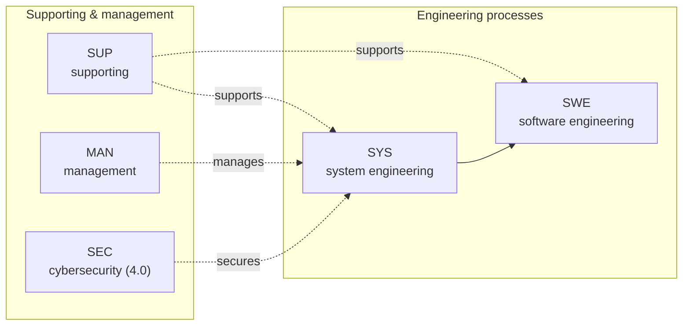
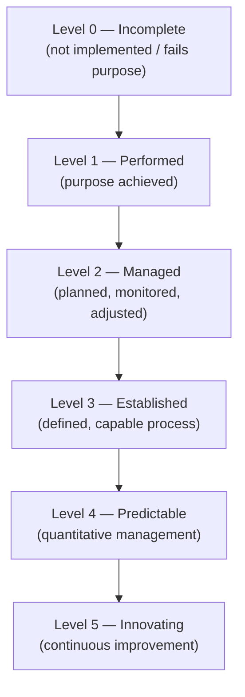

Author: Prashant Gawai

Version: 3.1

**Table of Content**

[**Introduction: 2**](#introduction)

> [3.2.1. Process Capability Levels and Process Attributes
> 2](#process-capability-levels-and-process-attributes)
>
> [Capability Levels 2](#capability-levels)
>
> [Process Attributes (PA) defined: 3](#process-attributes-pa-defined)
>
> [3.2.2. Rating Scale 3](#rating-scale)
>
> [3.2.2. Process Capability Level Model
> 4](#process-capability-level-model)
>
> [3.3. Process Assessment Model (PAM) 4](#process-assessment-model-pam)
>
> [4.3.4. SYS.4 System Integration and Integration Test
> 5](#sys.4-system-integration-and-integration-test)
>
> [4.3.5. SYS.5 System Qualification Test
> 7](#sys.5-system-qualification-test)

[**Annex D : Key concepts 9**](#annex-d-key-concepts)

> [D.1. The "Plug-in" concept 9](#d.1.-the-plug-in-concept)
>
> [D.2. The Tip of the "V" 10](#d.2.-the-tip-of-the-v)
>
> [D.3. Terms "Element", "Component", "Unit" and "Item"
> 11](#d.3.-terms-element-component-unit-and-item)
>
> [D.4. Traceability and Consistency
> 12](#d.4.-traceability-and-consistency)
>
> [D.5. "Agree" and "Summarise and Communicate"
> 13](#d.5.-agree-and-summarise-and-communicate)
>
> [D.6. "Evaluate", "Verification Criteria" and "Ensuring Compliance"
> 14](#d.6.-evaluate-verification-criteria-and-ensuring-compliance)
>
> [D.7. Relation between "Strategy" and "Plan"
> 15](#d.7.-relation-between-strategy-and-plan)

"*Evaluates performance of the development processes of control unit
suppliers*"

SPICE - **S**oftware **P**rocess **I**mprovement and **C**apability
**D**etermination

**Reference (PAM 3.1):** [Automotive SPICE PAM v3.1](https://www.automotivespice.com/fileadmin/software-download/AutomotiveSPICE_PAM_31.pdf)

> **Update (Nov 2023):** **Automotive SPICE 4.0** is the current edition, published by VDA QMC. It replaces **PAM 3.1** and adds, among others, a **Cybersecurity extension** (aligned with ISO/SAE 21434) and closer alignment with ISO 26262. A **Mechanical Engineering (ME-SPICE)** extension also follows the plug-in concept.

# Introduction:

Automotive SPICE (AS) Process Assessment Model (PAM) is intended for use
when performing conformant assessments of the process capability on the
development of embedded automotive systems.

Automotive SPICE has its own Process Reference Model (PRM)

PRM is used in conjunction with the PAM when performing an Assessment.

PAM contains a set of indicators to be considered when interpreting the
intent of the ASPICE PRM. These indicators may also be used when
implementing a process improvement program subsequent to an assessment.

## Process Groups Overview

Automotive SPICE groups processes into process categories that are assessed together (e.g. within the **VDA Scope / HIS scope**):

| Group | Examples | Focus |
|---|---|---|
| **SYS** (System engineering) | SYS.1–SYS.5 | Requirements, architecture, integration, qualification |
| **SWE** (Software engineering) | SWE.1–SWE.6 | Requirements, architecture, design, unit & integration testing |
| **SUP** (Supporting) | SUP.1, SUP.8, SUP.9, SUP.10 | Quality assurance, configuration, problem resolution, change management |
| **MAN** (Management) | MAN.3, MAN.5 | Project & risk management |
| **ACQ / PYR / REU** | — | Acquisition, reuse, process improvement |
| **Cybersecurity** (ASPICE 4.0 extension) | SEC | Cybersecurity engineering, aligned with ISO/SAE 21434 |

### 3.2.1. Process Capability Levels and Process Attributes

#### Capability Levels

<table>
<colgroup>
<col style="width: 25%" />
<col style="width: 75%" />
</colgroup>
<thead>
<tr>
<th>
<strong>Level 0 :</strong>

<strong>Incomplete Process</strong>
</th>
<th>The process is NOT implemented, or fails to achieve its process
purpose</th>
</tr>
<tr>
<th>
<strong>Level 1 :</strong>

<strong>Performed Process</strong>
</th>
<th>The implemented process achieves its process purpose</th>
</tr>
<tr>
<th>
<strong>Level 2 :</strong>

<strong>Managed Process</strong>
</th>
<th>The previously described performed process is now implemented in a
managed fashion (<strong>planned, monitored and adjusted</strong>) and
its <strong>work products are appropriately established, controlled and
maintained</strong>.</th>
</tr>
<tr>
<th>
<strong>Level 3 :</strong>

<strong>Established Process</strong>
</th>
<th>The previously described Managed Process is now implemented using a
<strong>defined process</strong> that is capable of achieving its
process outcome.</th>
</tr>
<tr>
<th>
<strong>Level 4 :</strong>

<strong>Predictable process</strong>
</th>
<th>The previously described established process now operates
predictively within defined limits to achieve its process outcomes.
<strong>Quantitative Management</strong> needs are identified,
measurement data are collected and analysed to identify assignable
causes of variation. Corrective action is taken to address assignable
causes of variation.</th>
</tr>
<tr>
<th>
<strong>Level 5 :</strong>

<strong>Innovating Process</strong>
</th>
<th>The previously described predictable process is now continually
improved to respond to organisational change.</th>
</tr>
</thead>
<tbody>
</tbody>
</table>

#### Process Attributes (PA) defined:

Level 0 : Incomplete process

Level 1 : Performed Process

**Process** **Performance** Process Attribute

Level 2 : Managed Process

**Performance** **Management** Process Attribute

Level 3 : Established Process

**Process** **Definition** Process Attribute

**Process** **Deployment** process attribute

Level 4 : Predictable Process

**Quantitative analysis** process attribute

**Quantitative Control** process attribute

Level 5 : Innovating Process

**Process Innovation** Process Attribute

**Process Innovation Implementation** process attribute

### 3.2.2. Rating Scale

A process attribute rating is a judgement of the degree of achievement
of the process attribute.

<table>
<colgroup>
<col style="width: 25%" />
<col style="width: 74%" />
</colgroup>
<thead>
<tr>
<th>
<strong>N : Not achieved</strong>

0 to &lt;= 15%
</th>
<th>There is little or no evidence of achievement of the defined PA</th>
</tr>
<tr>
<th>
<strong>P : Partially achieved</strong>

&gt;15 to &lt;= 50%
</th>
<th>There is some evidence of an approach to and some achievement of,
the defined PA. Some aspects of achievement of PA may be
unpredictable.</th>
</tr>
<tr>
<th style="text-align: left;">
<strong>L : Largely
achieved</strong>

&gt; 50 to &lt;= 85%
</th>
<th style="text-align: left;">There is evidence of a systematic approach
to, and significant achievement of, the defined PA. Some weaknesses
related to this PA may exist.</th>
</tr>
<tr>
<th style="text-align: left;">
<strong>F : Fully achieved</strong>

&gt; 85 to &lt;= 100%
</th>
<th style="text-align: left;">There is evidence of a complete and
systematic approach to, and full achievement of, the defined PA. No
signifiant weaknesses related to this PA exist.</th>
</tr>
</thead>
<tbody>
</tbody>
</table>

### 3.2.2. Process Capability Level Model

<table>
<colgroup>
<col style="width: 9%" />
<col style="width: 57%" />
<col style="width: 33%" />
</colgroup>
<thead>
<tr>
<th style="text-align: left;"><strong>Scale</strong></th>
<th style="text-align: left;"><strong>Process Attribute
(PA)</strong></th>
<th style="text-align: left;"><strong>Rating</strong></th>
</tr>
<tr>
<th style="text-align: left;">Level 1</th>
<th style="text-align: left;"><strong>PA 1.1: Process
Performance</strong></th>
<th style="text-align: left;">Largely</th>
</tr>
<tr>
<th style="text-align: left;">Level 2</th>
<th style="text-align: left;">
PA 1.1: Process Performance

<strong>PA 2.1: Performance Management</strong>

<strong>PA 2.2: Work Product Management</strong>
</th>
<th style="text-align: left;">
Fully

Largely

Largely
</th>
</tr>
<tr>
<th style="text-align: left;">Level 3</th>
<th style="text-align: left;">
PA 1.1: Process Performance

PA 2.1: Performance Management

PA 2.2: Work Product Management

<strong>PA 3.1: Process Definition</strong>

<strong>PA 3.2: Process Deployment</strong>
</th>
<th style="text-align: left;">
Fully

Fully

Fully

Largely

Largely
</th>
</tr>
<tr>
<th style="text-align: left;">Level 4</th>
<th style="text-align: left;">
PA 1.1: Process Performance

PA 2.1: Performance Management

PA 2.2: Work Product Management

PA 3.1: Process Definition

PA 3.2: Process Deployment

<strong>PA 4.1: Quantitative Analysis</strong>

<strong>PA 4.2: Quantitative Control</strong>
</th>
<th style="text-align: left;">
Fully

Fully

Fully

Fully

Fully

Largely

Largely
</th>
</tr>
<tr>
<th style="text-align: left;">Level 5</th>
<th style="text-align: left;">
PA 1.1: Process Performance

PA 2.1: Performance Management

PA 2.2: Work Product Management

PA 3.1: Process Definition

PA 3.2: Process Deployment

PA 4.1: Quantitative Analysis

PA 4.2: Quantitative Control

<strong>PA 5.1: Process Innovation</strong>

<strong>PA 5.2: Process Innovation Implementation</strong>
</th>
<th style="text-align: left;">
Fully

Fully

Fully

Fully

Fully

Fully

Fully

Largely

Largely
</th>
</tr>
</thead>
<tbody>
</tbody>
</table>

## 3.3. Process Assessment Model (PAM)

**Two types of indicators:**

1)  Performance Indicators

2)  Capability Indicators

**Performance Indicators:**

1)  Base Practices (BP)

2)  Work Products (WP)

BP and WP are always process-specific.

**Process Capability Indicators:**

1)  Generic Practice (GP)

2)  Generic Resource (GR)

GP and GR related to one or more PA achievements.

And they are generic in nature (unlike BP, WP)

### 4.3.4. SYS.4 System Integration and Integration Test

**Purpose:**

The purpose of the System Integration and Integration Test Process is to
integrate the system items to produce an integrated system consistent
with the system architectural design and to ensure that the system items
are tested to provide evidence for compliance of the integrated system
items with the system architectural design, including the interfaces
between system items.

I.e. (in short)

- Integrate system items

- Check consistency and compliance with system architecture

- Check compliances of interfaces between system items

**Outcomes:**

As a result of successful implementation of this process:

1\) a system **integration strategy consistent with the project plan**,
the release plan and the system architectural design is developed to
integrate the system items;

2\) a system integration test strategy including the **regression test
strategy** is developed to test the system item interactions;

3\) a specification for system integration test **according to the
system integration test strategy** is developed that is suitable to
provide evidence for compliance of the integrated system items with the
system architectural design, including the interfaces between system
items;

4\) system items are integrated up to a complete integrated system
according to the integration strategy;

5\) **test cases** included in the system integration test specification
are selected according to the **system integration test strategy and the
release plan**;

6\) system item interactions are **tested using the selected test
cases** and the results of system integration testing are recorded;

7\) consistency and **bidirectional traceability** between the elements
of the **system architectural** design and **test cases** included in
the system integration test specification and bidirectional traceability
between **test cases and test results** is established; and

8\) **results** of the system integration test are **summarised and
communicated** to all affected parties.

**Base Practices:**

**SYS.4.BP1:** Develop **system integration strategy**. Develop a
strategy for integrating the system items consistent with the **project
plan and the release plan**. **Identify system items based on the system
architectural design** and define a sequence for integrating them.
\[OUTCOME 1\]

**SYS.4.BP2:** Develop system integration test strategy **including
regression test strategy**. Develop a strategy for testing the
integrated system items following the integration strategy. This
includes a **regression test strategy** for re-testing integrated system
items if a system item is changed. \[OUTCOME 2\]

**SYS.4.BP3:** Develop specification for system integration test.
**Develop the test specification** for system integration test including
the test cases for each integration step of a system item according to
the system integration test strategy. The test specification shall be
suitable to provide evidence for compliance of the integrated system
items with the system architectural design.

\[OUTCOME 3\]

*NOTE 1: The **interface descriptions** between system elements are an
input for the system integration test cases.*

*NOTE 2: Compliance to the architectural design means that the specified
integration tests are suitable to **prove that the interfaces between
the system items fulfill the specification** given by the system
architectural design.*

*NOTE 3: The system integration test cases may focus on*

*• the **correct signal** flow between system items*

*• the **timeliness** and **timing dependencies** of signal flow between
system items*

*• the **correct interpretation** of signals by all system items using
an interface*

*• the **dynamic interaction** between system items*

*NOTE 4: The system integration test may be supported **using simulation
of the environment** (e.g. **Hardware-in-the-Loop** simulation,
**vehicle network simulations**, digital **mock-up**).*

**SYS.4.BP4:** Integrate system items. Integrate the system items to an
integrated system according to the system integration strategy.
\[OUTCOME 4\]

*NOTE 5: The system integration can be performed **step wise**
integrating system items (e.g. the **hardware** elements as prototype
hardware, peripherals (**sensors** and **actuators**), the **mechanics**
and integrated **software**) to produce a system consistent with the
system architectural design.*

**SYS.4.BP5:** Select test cases. Select test cases from the system
integration test specification. The selection of test cases shall have
**sufficient coverage** according to the system integration test
strategy and the release plan. \[OUTCOME 5\]

**SYS.4.BP6:** Perform system integration test. Perform the system
integration test using the selected test cases. **Record the integration
test results** and logs. \[OUTCOME 6\]

*NOTE 6: See SUP.9 for handling of non-conformances.*

**SYS.4.BP7:** Establish bidirectional traceability. Establish
**bidirectional traceability** between elements of the system
architectural design and test cases included in the system integration
test specification. Establish bidirectional traceability between test
cases included in the system integration test specification and system
integration test results. \[OUTCOME 7\]

*NOTE 7: Bidirectional traceability supports coverage, consistency and
impact analysis.*

**SYS.4.BP8:** Ensure consistency. **Ensure consistency** between
elements of the system architectural design and **test cases** included
in the system integration **test specification**. \[OUTCOME 7\]

*NOTE 8: Consistency is supported by bidirectional traceability and can
be demonstrated by review records.*

**SYS.4.BP9:** Summarize and communicate results. **Summarize** the
system integration test results and communicate them to all affected
parties. \[OUTCOME 8\]

*NOTE 9: Providing all necessary information from the test case
execution in a summary enables other parties to judge the consequences.*

**Output work products:**

> 08-50 Test specification → \[OUTCOME 3, 5\]
>
> 08-52 Test plan → \[OUTCOME 1, 2\]
>
> 11-06 System → \[OUTCOME 4\]
>
> 13-04 Communication record → \[OUTCOME 8\]
>
> 13-19 Review record → \[OUTCOME 7\]
>
> 13-22 Traceability record → \[OUTCOME 7\]
>
> 13-50 Test result → \[OUTCOME 6, 8\]

### 4.3.5. SYS.5 System Qualification Test

**Purpose:**

Ensures that the integrated system is tested to provide evidence for
compliance with the system requirements and that the system is ready for
delivery

**Process outcomes:**

As a result of successful implementation of this process:

1\) A system qualification test strategy including regression test
strategy consistent with the project plan and release plan is developed
to test the integration system;

2\) a specification for system qualification test of the integrated
system according to the system qualification test strategy is developed
that is suitable to provide evidence for compliance with the system
requirements;

3\) test cases included in the system qualification test specification
are selected according to the system qualification test strategy and the
release plan;

4\) the integrated system is tested using the selected test cases and
the results of system qualification test are recorded;

5\) consistency and bidirectional traceability are established between
system requirements and test cases included in the system qualification
test specification and between test cases and test results; and

6\) results of the system qualification test are summarized and
communicated to all affected parties.

**Base Practices:**

**SYS.5.BP1:** Develop system **qualification test strategy** including
**regression test strategy**. Develop a strategy for system
qualification test consistent with the project plan and the release
plan. This includes a regression test strategy for **re-testing the
integrated system if a system item is changed**. \[OUTCOME 1\]

**SYS.5.BP2:** Develop **specification** for system **qualification
test**. Develop the specification for system qualification test
including test cases based on the verification criteria according to the
system qualification test strategy. The test specification shall be
suitable to provide evidence for compliance of the integrated system
with the system requirements. \[OUTCOME 2\]

**SYS.5.BP3:** Select test cases. Select test cases from the system
qualification test specification. The selection of test cases shall have
**sufficient coverage** according to the system qualification test
strategy and the release plan. \[OUTCOME 3\]

**SYS.5.BP4:** Test integrated system. **Test the integrated system**
using the selected test cases. Record the system qualification **test
results** and logs. \[OUTCOME 4\]

*NOTE 1: See SUP.9 for handling of non-conformances.*

**SYS.5.BP5:** Establish **bidirectional traceability**. Establish
bidirectional traceability between **system requirements** and **test
cases** included in the system qualification test specification.
Establish bidirectional traceability between test cases included in the
system qualification test specification and system qualification test
results. \[OUTCOME 5\]

*NOTE 2: Bidirectional traceability supports coverage, consistency and
impact analysis.*

**SYS.5.BP6:** Ensure consistency. **Ensure consistency** between system
requirements and test cases included in the system qualification test
specification. \[OUTCOME 5\]

*NOTE 3: Consistency is supported by bidirectional traceability and can
be demonstrated by review records.*

**SYS.5.BP7:** Summarize and communicate results. **Summarize the system
qualification test results** and communicate them to all affected
parties. \[OUTCOME 6\]

*NOTE 4: Providing all necessary information from the test case
execution in a summary enables other parties to judge the consequences.*

**Output work products**

> 08-50 Test specification → \[OUTCOME 2, 3\]
>
> 08-52 Test plan → \[OUTCOME 1\]
>
> 13-04 Communication record → \[OUTCOME 6\]
>
> 13-19 Review record → \[OUTCOME 5\]
>
> 13-22 Traceability record → \[OUTCOME 5\]
>
> 13-50 Test result → \[OUTCOME 4, 6\]

# Annex D : Key concepts

## D.1. The "Plug-in" concept

Top level system engineering processes.

## D.2. The Tip of the "V"

All the engineering processes (i.e. system engineering and software
engineering) has been organised according to the "V model" principle in
such a way that each process on the left side is corresponding to
exactly one process on the right side.

## D.3. Terms "Element", "Component", "Unit" and "Item"

An architecture consists of architectural "elements" that can be further
decomposed into more fine grained architectural sub-"elements" across
appropriate hierarchical levels.

The software "components" are the lowest-level "elements" of the
software architecture for which finally the detailed design is defined.

A software "component" consists of one or more software "units".

"Items" on the right side of the V-model correspond to "elements" on the
left side (e.g. a software "item" can be an object file, a library or an
executable). This can be a 1:1 or m:n relationship, e.g. an "item" may
represent more than one architectural "element".

## D.4. Traceability and Consistency

Traceability between two separate BP. Traceability refers to the
existence of references or lins between WP, to support coverage, impact
analysis, requirements implementation status tracking etc.

Furthermore, bidirectional traceability is defined between:

1.  Test cases and tes results

2.  Change-requests and WPs affected by the change-requests

## D.5. "Agree" and "Summarise and Communicate"

Information flow from lef-side of the "V" is to ensure BP "Communication
agreed". "Agreed" means **joined** understanding between affected
parties.

Information flow on the right-side of the "V" is ensured through BP
"Summarise and Communicate results".

## D.6. "Evaluate", "Verification Criteria" and "Ensuring Compliance"

This section describes verification, testing, evaluation and compliance.

- Verification Criteria is the input for test-cases

Verification criteria only used in SYS.2 (System Requirements Analysis)
and SWE.1 (Software Requirements Analysis)

Possible criteria for unit-verification include:

- Unit test cases

- Unit test data

- Coverage goals

- Coding standards

- Code guidelines (MISRA)

## D.7. Relation between "Strategy" and "Plan"

Each process-specific "plan" inherits work-product characteristics
represented by the "Generic Plan".

