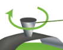
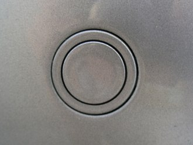
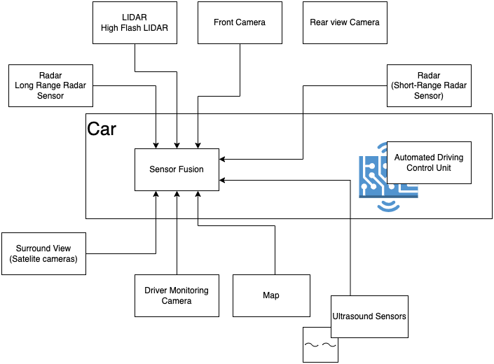
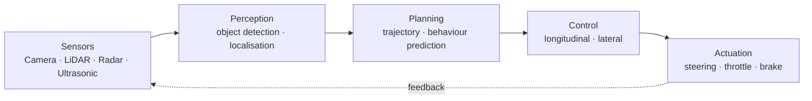
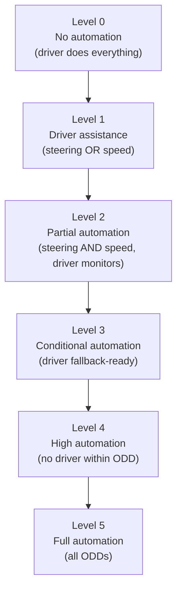

# Advanced Driver Assistance Systems (ADAS)

**Author:** Prashant Gawai
**Original date:** 30 June 2023
**Reviewed & updated:** 2026

---

## Table of Contents

- [Introduction](#introduction)
- [Data Sources for ADAS](#data-sources-for-adas)
  - [LiDAR / LADAR / LIDAR](#lidar--ladar--lidar)
  - [Cameras](#cameras)
  - [Parking Sensor / Proximity Sensors](#parking-sensor--proximity-sensors)
  - [Radar](#radar)
  - [GPS](#gps)
  - [Computer Vision](#computer-vision)
  - [Diagram](#diagram)
- [The Automated Driving Pipeline](#the-automated-driving-pipeline)
- [ADAS Levels](#adas-levels)
- [ADAS Features](#adas-features)
  - [Alerts warnings](#alerts-warnings)
  - [Crash Mitigation](#crash-mitigation)
  - [Driving Task Assistance](#driving-task-assistance)
  - [Visual and Environmental Monitoring](#visual-and-environmental-monitoring)

---

# Introduction

ADAS is an electronic technology that assists drivers in driving or
parking. It uses cameras and sensors to detect nearby obstacles or
errors and responds accordingly.

Safety features are designed to avoid crashes and collisions by offering
alerts to drivers, implementing safeguards and taking control of the
vehicle if necessary.

Adaptive features may automate lighting, adaptive cruise control, avoid
collisions, incorporate satellite navigation and traffic warnings, alert
drivers, assist in lane departure and lane centering, provide assistance
through smart phones and such.

# Data Sources for ADAS:

- Automotive Imaging (Surround view cameras, e-mirrors etc)

- LiDAR

- Radar

- Image Processing

- Computer Vision

- In-car networking

> Advanced:

- V2V (Vehicle to vehicle)

- V2I (vehicle to infrastructure)

- Over-the-air updates (OTA)

## LiDAR / LADAR / LIDAR

Light detection and ranging or laser imaging, detection and
ranging

Constantly spinning, it uses laser beams to generate a 360-degree image
of the car’s surroundings.

Also known as, 3D laser scanning

Ranges means - target an object with laser and measuring the time for
the reflected light to return to receiver

It is useful terrestrial, airborne and mobile applications

Commonly used in maps, surveying, geomatics, archeology, geology,
forestry etc.

**Components:**

- Eye-safe high power lasers

- Phased arrays - microscopic array of individual antennas. These
  control timing of each antenna steers in a specific direction.

- Microelectromechanical machines (MEMS)

- Sensors

ACC, EBA (Emergency Brake Assist) and Anti-lock Braking System (ABS)
depend on detection of a vehicle's environment to act autonomously or
semi-autonomously. Lidar mapping and estimation achieve this.

## Cameras

Uses parallax from multiple images to find the distance to various
objects. Cameras also detect traffic lights and signs, and help
recognize moving objects like people and vehicles.

## Parking Sensor / Proximity Sensors

Alert driver of obstacles while parking. They use electromagnetic or
ultrasonic sensors. These sensors emit acoustic pulses, with a control
unit measuring the return interval of each reflected signal and
calculating object distances.

## Radar

Neither LidAR, nor Camera can detect the objects in fog. For this there
is a need to use RADAR for collision detection. Disadvantage is -
objects should be large enough to detect. Padestrians, Cyclist may not
be detected by Radar.

## GPS

Exact position is detected. Digital Maps. Lot of information about
intersection signs, speed limit.

Odometry is needed.

## Computer Vision

Computer vision processes images and video from cameras to understand the driving scene:

- **Object detection & classification** — vehicles, pedestrians, cyclists, traffic signs and signals
- **Lane & road-marking detection** — lane boundaries, drivable area
- **Semantic segmentation** — pixel-level understanding of the scene
- **Depth estimation / 3D reconstruction** — from single or stereo cameras
- **Feature tracking & optical flow** — motion of objects relative to the ego-vehicle

Modern ADAS uses **deep neural networks** (CNNs, transformers) for these tasks; see the *CPU, GPU, MCU, NPU in automotive* document for the compute implications.

## Diagram

Created using draw.io

# The Automated Driving Pipeline

An ADAS / automated-driving function follows a four-stage pipeline from sensing to actuation:

1. **Perception** — convert raw sensor data into an understanding of the environment (object detection, semantics, traversable space).
2. **Planning** — generate a safe trajectory toward the destination (path planning, behaviour prediction).
3. **Control** — track the planned trajectory (longitudinal: throttle/brake; lateral: steering).
4. **Actuation** — execute on the vehicle actuators (steering, braking, acceleration).

**Motion modelling:** the vehicle's motion is described by **linear velocity (V)** and **angular velocity (ω)**; kinematic models relate these to steering and throttle for control.

# ADAS Levels

The six-level taxonomy is defined by **SAE J3016** (*Taxonomy and Definitions for Terms Related to Driving Automation Systems for On-Road Motor Vehicles*, April 2021 revision). It classifies automation by **who performs the Dynamic Driving Task (DDT)** — the human driver or the system — and under which **Operational Design Domain (ODD)**.

Key concepts:

- **DDT (Dynamic Driving Task):** steering, accelerating/braking, and monitoring the environment while driving.
- **ODD (Operational Design Domain):** the conditions (road types, speed, weather, time of day) under which a feature is designed to operate.
- **Fallback:** what happens when the system leaves its ODD or fails (handover to the driver, or a Minimum Risk Maneuver).

| Level | Name | Driver role | System role | Examples |
|---|---|---|---|---|
| 0 | No Driving Automation | performs all DDT | momentary warnings / interventions | FCW, AEB, LDW |
| 1 | Driver Assistance | performs all DDT, supported by the system | single-axis control (steering **or** speed) | ACC, LKA, lane centering |
| 2 | Partial Driving Automation | monitors the environment, must take over | lateral **and** longitudinal control | highway assist, automatic parking |
| 3 | Conditional Driving Automation | fallback-ready (not monitoring) | drives within ODD; requests take-over | traffic-jam chauffeur (e.g. Mercedes Drive Pilot) |
| 4 | High Driving Automation | not required within ODD | drives within ODD; Minimum Risk Maneuver if needed | geofenced robotaxi, automated valet parking |
| 5 | Full Driving Automation | none | drives in all ODDs and all conditions | not yet commercially available |

Typical feature detail per level:

- **Level 1:** adaptive cruise control, emergency / automatic emergency brake assist, lane keeping, lane centering — the driver does most decision-making; ADAS takes over **one** functionality.
- **Level 2:** highway assist, autonomous obstacle avoidance, autonomous parking — the vehicle controls steering and acceleration, but the driver monitors all tasks and can take control; ADAS takes over **multiple** functionalities.
- **Level 3:** drives itself in particular conditions and takes control of all safety-critical functions; when requested, the driver must take over.
- **Level 4:** driverless taxis / public transport, travel from a specific A to B, restricted by geofencing.
- **Level 5:** fully autonomous — steering wheel optional.

# ADAS Features

Only major ones are listed here. This is NOT a complete list.

## Alerts warnings

1.  **Alcohol** Ignition Interlock Device**:** doesn't start car if
    breath alcohol is above pre-described amount

2.  **Blind Spot** Monitor**:** (side area / behind of the vehicle):
    works in conjunction with emergency braking

3.  Driver **Drowsiness** Detection: checks driver fatigue, facial
    patterns, driving movements

4.  Driver **Monitoring** System: eye-tracking, attention-tracking. Uses
    infrared sensors and cameras

5.  **Electric Vehicle** Warning Sounds: notify pedestrians, cyclists
    that EV is nearby

6.  Forward **Collision** Warning (FCW): alerts of possible collision if
    gets close to front vehicle

7.  Intelligent **Speed** Adaptation/Advice (ISA): assists drivers with
    compliance to speed limit

8.  **Intersection** Assistants: Uses Radar on front and side. Alerts
    driver of any upcoming traffic from sides

9.  **Lane Departure** Warning (LDW): when partially merge into a lane
    without using turn signals

10. **Parking** Sensors: audio warnings to notify distance of
    surrounding objects

11. **Tire pressure** monitoring: when pressure outside normal inflation
    range

12. **Vibrating seat** warning alert: if driver drifts, the seat
    vibrates in the direction of drift

13. **Wrong-way** driving warning: detect when driving on the wrong side
    of the road

## Crash Mitigation

- **Pedestrian Protection** Systems: designed to minimize the number of
  injuries to pedestrians. Uses a camera.

## Driving Task Assistance

1.  Adaptive Cruise Control (ACC)

2.  Anti-lock Braking System (ABS)

3.  Automatic Parking

4.  Collision Avoidance System

5.  Crosswind Stabilization

6.  Cruise Control

7.  Electronic Stability Control (ECS)

8.  Emergency driver assistant

9.  Hill-start assist

10. Lane Centering

11. Lane Change Assistance

12. Rain Sensors

13. Traction Control System

## Visual and Environmental Monitoring

1.  Automotive head-up display (Auto-HUD)

2.  Automotive Navigation System

3.  Automotive Night Vision

4.  Backup Camera

5.  Glare-free high beam

6.  Omniview technology

7.  Traffic sign recognition (TSR)

8.  Vehicular Communication Systems

Many more features listed in:
[https://www.youtube.com/watch?v=EiWl5PAtfYA](https://www.youtube.com/watch?v=EiWl5PAtfYA)
