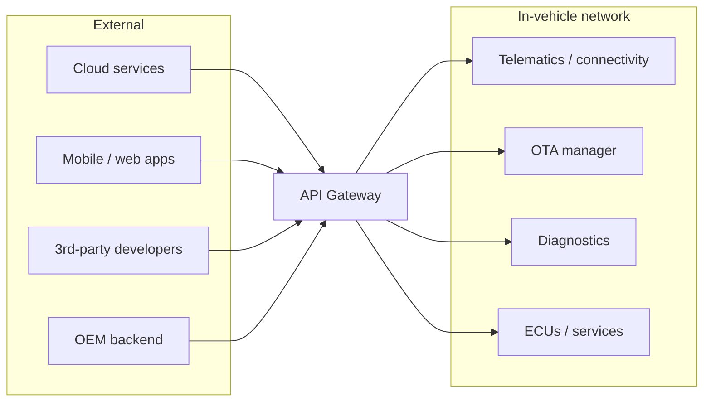
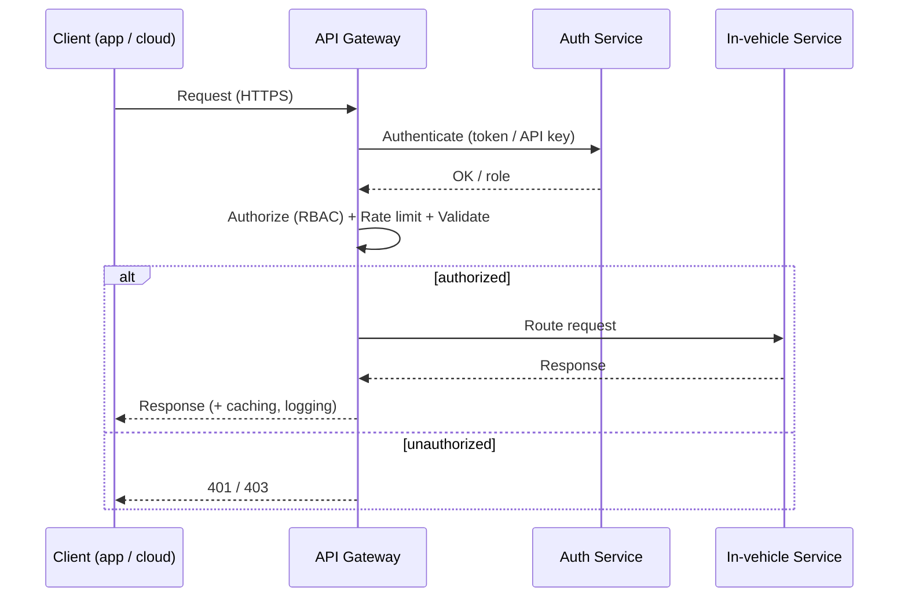

# In-Vehicle API Gateway

**Document by:** Prashant Gawai
**Date:** October 2023
**Reviewed & restructured:** 2026

---

## 1. Introduction

The **API Gateway** connects the in-vehicle network with external cloud-based services. It is the central entry point for all external requests and must be **scalable, load-balanced**, and handle **API request routing**.

It also addresses **protocol translation**, **security aspects**, and **IAM (in-vehicle and external)**, including bi-directional / uni-directional content, design patterns, and access-control policies.

### Use cases

1. **Integration of 3rd-party services** — navigation apps, entertainment services, IoT devices.
2. **Remote vehicle monitoring and control** — locking/unlocking doors, starting the engine, climate control, tracking vehicle location.
3. **Telematics and diagnostics** — collect and transmit vehicle data; manufacturers and service centres monitor health, performance and maintenance.
4. **Over-the-Air (OTA) updates** — deliver software updates and patches; improve functionality, security and compliance.
5. **Entertainment and infotainment** — streaming music, video, news, weather and traffic.
6. **Navigation** — real-time traffic, route planning, points of interest.
7. **Remote assistance and support.**
8. **Energy efficiency and eco-driving.**
9. **User and vehicle data insights** — in-vehicle data analytics to improve design and develop new features.
10. **User and application management** — allow 3rd-party developers to manage apps and keys; secure access to in-vehicle services.
11. **Data privacy and regulatory compliance** — e.g. GDPR.
12. **Security and safety** — the API gateway enhances the overall security of vehicle software.
13. **User experience enhancement** — connected-car, user-friendly experience.
14. **Customization and personalization** — integrate apps suiting user preferences.

## 2. Core Functions

1. Request routing
2. Load balancing
3. Authentication
4. Authorization
5. Security (HTTPS, threat analysis)
6. Rate limiting
7. Request / response transformation
8. Caching
9. Logging and monitoring
10. Traffic control and routing policies
11. Version management
12. Error handling
13. Response aggregation (advanced)
14. Scalability and redundancy
15. Developer portal (advanced)
16. Compliance and regulatory enforcement
17. Request validation

## 3. High-Level Architecture

The API Gateway sits between external entities (cloud services, apps, third-party developers, OEM backend) and the in-vehicle network:



### Request flow



## 4. Protocols

| Protocol | Use |
|---|---|
| **HTTP / HTTPS** | most common; HTTPS is essential for encrypting data in transit |
| **WebSocket** | real-time, bidirectional, low-latency client-server communication |
| **REST** | architectural style using GET / POST / PUT / DELETE |
| **gRPC** | high-performance RPC framework using Protobuf serialization |
| **GraphQL** | query language; request exactly the data you need |
| **AMQP** | message queuing and routing; event-driven architecture |
| **MQTT** | lightweight publish-subscribe messaging |
| **TCP / UDP** | low-level socket connections |

## 5. Security and API Gateways

1. **Authentication and Authorization** — use RBAC; user and application authentication.
2. **Transport Layer Security** — HTTPS; SSL/TLS certificate management via a certificate authority (CA).
3. **API Security** — input validation, rate limiting, data validation.
4. **Data Privacy and Compliance** — GDPR compliance; data encryption; data-retention policies.
5. **Secure Developer Portal** — registration and verification (API keys, email verification, MFA); API key management.
6. **Logging and Monitoring** — audit trails (API usage, user actions, access attempts, security events); real-time monitoring.
7. **Security Incident Response Plan** — define roles, responsibilities and process for incidents.
8. **Firewall and Intrusion Detection / Prevention.**
9. **Updates and Security Patches.**
10. **Encryption Key Management.**
11. **Vulnerability Scanning.**
12. **Network Security** — segmentation and isolation of the network.
13. **Regulatory Compliance.**
14. **Redundancy and Failover.**

## 6. Users and Roles

### Roles and accessible modules

| Role | Accessible modules |
|---|---|
| Vehicle Owner / Driver | Entertainment services, vehicle control, diagnostics, user profile |
| Passenger | Entertainment services |
| Service Technician | Diagnostics, remote vehicle control |
| Service Administrator | Configuration management, developer portal, system monitoring |
| Vehicle Administrator | Configuration management |
| Security Officer | Security configuration, incident monitoring |
| Emergency Services Personnel | Vehicle data and diagnostics |
| IoT Devices (passive sensors) | Telematics data, vehicle sensors |
| Telematics Service Provider | Telematics data, data analysis |
| Data Logger | Data logging and storage |
| Car Manufacturer Representative | Remote support, vehicle diagnostics |
| Third-Party Service Provider | Access to specific modules as defined by API keys |

### In-vehicle vs external access

| Access | Role | Access scope |
|---|---|---|
| In-vehicle | Driver | full control — navigation, entertainment, climate control, vehicle diagnostics |
| In-vehicle | Passenger | limited — infotainment preferences, climate control in their zone |
| In-vehicle | Administrator (owner / fleet manager) | user profiles, vehicle settings, remote monitoring |
| In-vehicle | Guest user | limited features; restricted to prevent unauthorised changes |
| External | Developer | APIs via the developer portal, restricted by role and user consent |
| External | API Consumer | features of third-party applications |
| External | API Gateway Administrator | security, configuration, access-control policies, monitoring |
| External | Regulatory Authority | monitoring access to in-vehicle data for compliance |
| External | Service Provider | remote diagnostics, software patches, maintenance |
| External | Security Auditor | auditing and testing of the gateway security posture |
| External | Data Subject (owner / driver) | personal data; consent / revoke consent for data sharing |

## 7. Design Considerations

The API Gateway is a central entry point for all external requests. Key design areas:

- API request / response handling
- Authentication and authorization
- Request routing
- Logging and monitoring

### Simplified C++ class sketch

```cpp
class ApiGateway {
public:
    ApiGateway();
    bool authenticateUser(const std::string& username, const std::string& password);
    bool authorizeRequest(const std::string& token, const std::string& resource);
    bool addRoute(const std::string& path, const std::string& serviceEndpoint);
    bool removeRoute(const std::string& path);
    bool handleRequest(const APIRequest& request, APIResponse& response);
};
```

### Sample request routing

```cpp
bool ApiGateway::handleRequest(const APIRequest& request, APIResponse& response) {
    if (!authenticateRequest(request)) {
        response.status = 401; // Unauthorized
        response.body = "Authentication failed";
        return false;
    }
    if (!authorizeRequest(request)) {
        response.status = 403; // Forbidden
        response.body = "Authorization failed";
        return false;
    }
    std::string route = findRoute(request.path);
    if (route.empty()) {
        response.status = 404; // Not Found
        response.body = "Route not found";
        return false;
    }
    // Forward to the cloud service (in a real implementation, use HTTP libraries)
    APIRequest cloudRequest = createCloudRequest(request, route);
    APIResponse cloudResponse;
    // ... send cloudRequest to the service, store response in cloudResponse
    response.status = cloudResponse.status;
    response.body = cloudResponse.body;
    return true;
}
```

## 8. Design Checklist (Configuration Topics)

A comprehensive gateway design should address:

1. **Architecture** — high-level system architecture, key components, data flow, use cases.
2. **Configuration and parameters** — parameter management, configuration data types, load-time vs non-load-time parameters, dynamic parameter updates.
3. **Audit and log management** — audit logging, log retention, log levels, monitoring logs.
4. **Registration and discovery** — registration services, service discovery.
5. **Authentication and security** — authentication methods, security checks, RBAC.
6. **Health check** — health-check services, monitoring health.
7. **Service lifecycle management** — service start-up, shutdown, restart.
8. **Service information management** — service metadata, versioning, status.
9. **Load balancing** — load-balancer types, algorithms.
10. **Backup and restore** — backup strategy, restore process.
11. **Monitoring and telemetry** — real-time metrics, performance analysis, alerts and notifications.
12. **Version and compatibility management** — versioning strategy, compatibility guidelines.
13. **Cache and queue management** — content caching, distributed caching, message queues.
14. **Communication management** — communication protocols, integration with the SOA framework.
15. **Scalability and performance** — horizontal scalability, caching strategies, performance monitoring, load testing and tuning.
16. **Disaster recovery and redundancy** — redundancy configuration, data backup/recovery, failover testing, DR plan, communication plan.
17. **Security configurations** — access control, data encryption, threat protection, security auditing, security updates.
18. **Documentation and knowledge sharing** — documentation framework, training and onboarding, knowledge sharing.
