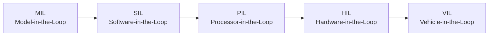
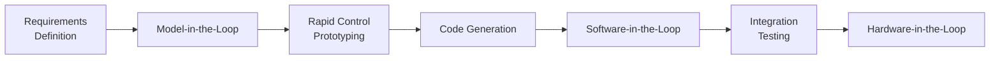
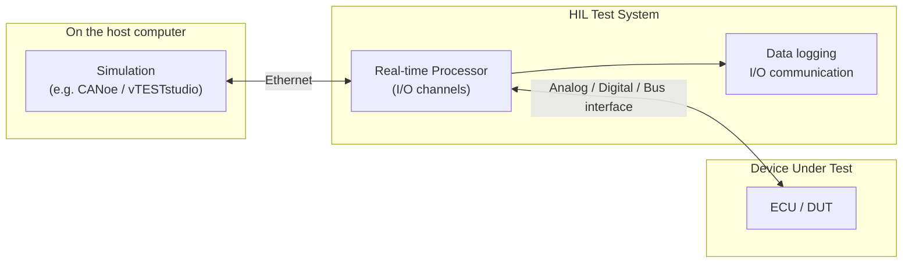

# Automotive Testing: Verification, Validation & X-in-the-Loop

**Author:** Prashant Gawai

---

## Verification vs Validation

- **Verification** — confirming that the design was implemented correctly during the implementation phase.
  - *Are we building the system right?*
  - Does it meet the specified design requirements?

- **Validation** — confirming that the system fulfils its intended purpose after it has been developed.
  - *Are we building the right system?*
  - Does it perform correctly in real-world scenarios?

Both are necessary and are iteratively executed across multiple rounds of testing.

### Verification techniques

- **Unit testing** — testing individual components / modules.
- **Integration testing** — testing the integration and interaction between multiple components/modules; ensures proper communication and data flow.
- **Software-in-the-Loop (SIL)** — simulating the ADAS system with virtual representations to test software functionality and behaviour.
- **Hardware-in-the-Loop (HIL)** — integrating software with physical hardware components (e.g. sensors, actuators) to validate performance in a realistic environment.

### Validation techniques

- **Field testing** — tests and experiments in real-world driving conditions.
- **Scenario-based testing** — designed test scenarios covering a wide range of driving situations, including challenging ones; see ISO 34502 for a scenario-based safety-evaluation framework.
- **Simulation testing** — computer simulation to recreate and analyse complex driving scenarios.
- **Compliance testing** — ensuring the system adheres to relevant safety standards and regulations.

## X-in-the-Loop (XiL) Testing

Automotive functions are validated across a spectrum of test environments, trading fidelity against cost and repeatability:

| Environment | Model | Plant / vehicle | Test focus |
|---|---|---|---|
| **MIL** — Model-in-the-Loop | control model | plant model | algorithm behaviour |
| **SIL** — Software-in-the-Loop | compiled software | plant model | software logic |
| **PIL** — Processor-in-the-Loop | software on target CPU | plant model | target performance |
| **HIL** — Hardware-in-the-Loop | software on ECU | real-time plant + I/O | ECU behaviour, comms, timing |
| **VIL** — Vehicle-in-the-Loop | full vehicle | real vehicle + simulation | end-to-end / subjective |

## HIL (Hardware-in-the-Loop)

ADAS is safety-critical; testing on real vehicles is **not viable** at scale, so **simulation** is the primary validation approach — hence **HIL testing**.

HIL testing validates software in a simulated environment: **ECU functions can be tested without the full vehicle**. It validates the **communication, system integration and functionality** of automotive software.

In the 'V'-cycle, testing progresses from requirements through model, software and hardware:

### HIL Test System

The **HIL Test System** is the heart of HIL testing. It simulates the ECUs and environment that the ECU under test must interact with:

The HIL test processor executes the components of the test system — **data logging, I/O communication**, etc.
