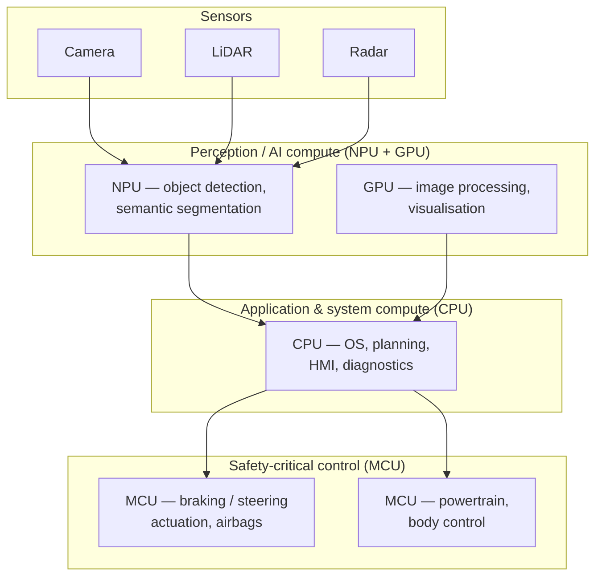

# CPU, GPU, MCU, NPU in Automotive

> Originally drafted with an AI assistant; reviewed and expanded for the SDV architecture context.

In the automotive domain, **CPU**, **GPU**, **MCU**, and **NPU** are different types of processors with specific roles. Understanding their differences — and how to map workloads to the right engine — is central to software-defined-vehicle (SDV) architecture.

## The Four Processor Types

### 1. CPU (Central Processing Unit)

- **Function:** the primary general-purpose processing unit — runs operating systems, executes software applications, and manages overall system operations.
- **Automotive application:** engine control, vehicle diagnostics, infotainment, and managing sensors/actuators.

### 2. GPU (Graphics Processing Unit)

- **Function:** specialised for rendering and manipulating graphics/images; excels at **parallel processing** and complex mathematical computation.
- **Automotive application:** high-resolution displays, multimedia, and visual ADAS / AR applications.

### 3. MCU (Microcontroller Unit)

- **Function:** a small, self-contained compute unit integrating a microprocessor, memory and peripherals on one chip; optimised for **low power** and **real-time control**.
- **Automotive application:** ECUs — engine control, powertrain control modules, ABS, airbag control units; executes real-time control algorithms and interfaces with sensors/actuators.

### 4. NPU (Neural Processing Unit)

- **Function:** specialised for **AI/ML acceleration** — highly optimised for the matrix/tensor computations used in neural networks.
- **Automotive application:** computer vision, object detection/recognition, autonomous driving, ADAS; enables efficient sensor-data processing and real-time AI decisions.

## Comparison

| | CPU | GPU | MCU | NPU |
|---|---|---|---|---|
| Primary role | general purpose | graphics / parallel | real-time control | AI / ML inference |
| Strengths | flexible, general logic | massive parallelism, math throughput | determinism, low power, integrated peripherals | high-efficiency tensor / neural ops |
| Cores | few, complex | many simple | 1–few | many specialised |
| Performance metric | moderate | high (TFLOPS) | low (deterministic) | very high (TOPS) |
| Automotive use | OS, diagnostics, control logic | displays, AR / ADAS visuals | ECUs, safety-critical control | ADAS perception, autonomous driving |

## Where Each Processor Fits in the Vehicle

## Similarities

- All four are integral components of automotive electronic systems.
- They perform specific computational tasks and contribute to overall vehicle functionality and performance.
- All process data, but they differ in the **type of data** processed and the **specific computational optimisations** they provide.

## Differences

- **CPUs** are general-purpose and handle overall system operations; **GPUs** are specialised for graphics and parallel workloads.
- **MCUs** are optimised for real-time control with integrated peripherals; **NPUs** are specialised for AI/ML computations.
- **GPUs and NPUs** offer massive parallelism (many simultaneous computations); **CPUs and MCUs** typically have fewer cores and suit sequential, deterministic processing.
- Each processor has its own architecture, instruction set and design considerations tailored to its use case.

## Selection Guidance

In an SDV, choose the right engine for the workload:

- **Deterministic safety control** (ASIL) → MCU / safety-MCU (e.g. Classic AUTOSAR)
- **General compute / orchestration** → CPU (e.g. Adaptive AUTOSAR on an SoC)
- **Graphics, HMI, AR** → GPU
- **Neural inference (perception)** → NPU
- **Consolidation** → SoC / HPC combining CPU + GPU + NPU on one die
