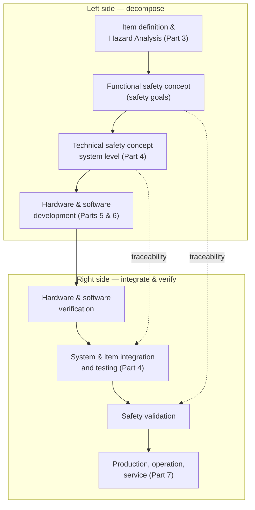
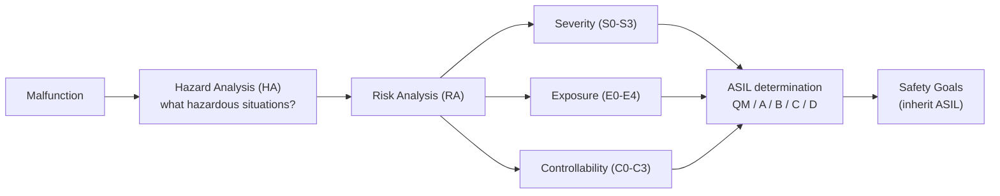

Document by: Prashant Gawai

Date: 27th June 2023

## Definition:

"*Absence of unreasonable risk due to hazards caused by malfunctioning
behaviour of EE systems*"

- **ISO 26262** — first edition **2011**, second edition **2018** (note: the standard is ISO 26262, not "ISO 2662").
- The 2018 second edition extended the scope from passenger cars to **all road vehicles (except mopeds)** and added **Part 11** (semiconductors) and **Part 12** (motorcycles) — **12 parts in total**.

## Introduction:

Software must be error-free in keeping its specifications.

## Goals of ISO 26262:

1)  **Provides a reference** for the automotive safety lifecycle and
    supports tailoring **of the activities to be performed during the
    lifecycle phases** i.e. development, production, operation, service
    and decommissioning

2)  **Provides** an automotive-specific risk-based approach **to
    determine integrity levels** \[**Automotive Safety Integrity
    Levels** (ASIL)\]

3)  **Uses ASILs to specify** which of the **requirements** of ISO 26262
    are applicable to **avoid unreasonable residual** risk

4)  **Provides requirements** for relations between customers and
    suppliers

**ISO 26262 series of standards is based on a V-model as a reference
process model** for different phases of product development.

The safety lifecycle follows a V-model: the **left side** decomposes requirements (concept → system → hardware/software), the **right side** integrates and verifies them, and confirmation measures ensure safety is achieved.

## Overview of ISO 26262 series of standards

1.  Vocabulary

2.  Management of functional safety

    1.  Project dependent safety management

    2.  Safety management regarding production, operation, service and
        decommissioning

3.  Concept phase

    1.  Definitions

    2.  Hazard analysis and risk assessment

4.  Product development at the system level

    1.  Technical safety concepts

    2.  System and item integration and testing

    3.  Safety validations

5.  Product development at the hardware level

6.  Product development at the software level

7.  Production, operation, service and decommissioning

8.  Supporting processes

    1.  Interfaces within distributed developments

    2.  Specification and management of safety requirements

    3.  Configuration management

    4.  Change management

    5.  Verification

    6.  Documentation management

    7.  Confidence in use of software tools

    8.  Evaluation of hardware elements

    9.  Proven in use argument

    10. Interfacing an application that is out of scope of ISO 26262

    11. Integration of safety-related systems not developed according to
        ISO 26262

9.  Automotive Safety Integrity Level (ASIL) and safety–oriented
    analyses

10. Guidelines on ISO 26262

11. Guidelines on application of ISO 26262 to semiconductors

12. Adaptation of ISO 26262 for motorcycles

## Part-1: Vocabulary:

**Item:** a specific system or combination of systems, that implements
function or part of the function

**Element:** either a system, a component (consisting of hardware and/or
software units) that can be distinctly identified and manipulated

**Fault:** abnormal condition that can cause an element or an item to
fail.

**Error:** Discrepancy between (computed, observed and measured value or
condition) and (the true, specified or theoretically correct value or
condition)

**Failure:** Termination of an intended behaviour of an element or an
item due to fault manifestation.

**Fault tolerance:** ability to deliver a specific functionality in the
presence of one or more specified faults.

**Malfunctioning Behaviour:** failure or unintended behaviour of an item
with respect to its design intent.

**Hazard:** Potential source of harm (physical injury or health damage)
caused by malfunctioning behaviour of the item.

**Functional Safety:** Absence of unreasonable risk due to hazards
caused by malfunctioning behaviour of EE systems

## Part-2: Management of Functional Safety

Functional safety management for:

\(1\) for automotive applications

\(2\) for overall organisational safety management

\(3\) for a safety life cycle for the development and production of
individual automotive products

**Hazardous Event:** is a relevant combination of a vehicle-level hazard
and an operational situation of the vehicle with **potential to lead to
an accident if not controlled** by timely driver action.

**Safety goal:** is a top level safety requirement that is assigned to a
system, with the purpose of reducing the risk of one or more hazardous
events to a tolerable level.

**Automotive Safety Integrity Level (ASIL):** risk-based classification
of a safety goal

**Safety Requirement:** includes all the safety goals and all levels of
software and hardware components.

## Automotive Safety Integrity Level (ASIL)

### 4 levels:

- ASIL-A: lowest risk

- ASIL-B:

- ASIL-C:

- ASIL-D: highest risk : **life-threatening or fatal-injury in the event
  of malfunction**

ASIL is established by performing risk analysis of potential hazard by
looking at

> \(1\) **Severity** (of failure)
>
> \(2\) (probability of) **Exposure**
>
> \(3\) **Controllability**

of the vehicle operating scenario.

Risk is generally expressed as:

> Risk = (expected loss in case of accident ) x (probability of the
> accident occurring)
>
> Or
>
> Risk = Severity x ( Exposure x Likelihood )

ASIL maybe similarly expressed as:

ASIL = Severity x ( Exposure x Controllability )

Hazards that are qualified as QM (Quality Management) do NOT dictate any
safety requirements. These are tolerable risks; and standard quality
management processes are sufficient for development.

**Severity Classifications (S):**

S0 : No Injuries

S1 : Light to moderate injuries

S2 : Severe to life-threatening (survival probable) injuries

**S3** : Life-threatening (survival uncertain) to fatal injuries

**Exposure Classifications (E):**

E0 : Incredibly unlikely

E1 : Very low probability (injury could happen only in rare operating
conditions)

E2 : Low probability

E3 : Medium probability

**E4** : High probability (injury could happen under most operating
conditions)

**Controllability Classifications (C):**

C0 : Controllable in general

C1 : Simply Controllable

C2 : Normally Controllable (most drivers could act to prevent injury)

**C3** : Difficult to control or uncontrollable

ASIL-D is combination of S3, E4, C3 classifications

Source:
[https://www.cselectricalandelectronics.com/wp-content/uploads/2022/10/image-1.png](https://www.cselectricalandelectronics.com/wp-content/uploads/2022/10/image-1.png)

**How to determine ASIL Value:**

1)  **Malfunction**

2)  **Hazard Analysis (HA):**

    1)  What unintended hazardous situation could occur?

3)  **Risk Analysis (RA):**

    1)  How likely is the hazard to happen (Exposure)

    2)  How harmful is the hazard? (Severity)

    3)  How controllable is the system if the hazard occurs?
        (Controllability)

4)  **ASIL Determination:**

    1)  What level of safety does the system need?

    2)  How likely can the malfunction be? 'Failure Rate'

    3)  How often does the system need to catch it and get to a safe
        situation?

    4)  Effectiveness of failure detection (SPFM, LFM)

**How ASIL Levels used in requirements:**

1)  HARA

2)  Derive ASIL Level specification of Safety Goals

3)  Specification of System Safety Requirements

    1)  Hardware Safety Requirements

    2)  Software Safety Requirements

    3)  Architecture

## Examples of ASIL A, B, C, D:

**ASIL A-QM:** Audio and Infotainment

- Connectivity - USB, HDMI

- Movie/Game systems

- GPS/Navigation

- Satellite/Digital radio

**ASIL A:**

- Rear lights (both sides failure)

**ASIL A-B:** (Body and convenience)

- Smart junction boxes

- Instrument clusters

- Heating and cooling

- Steering wheel sensor

- Body control units

- Body gateway

**ASIL B:**

- Instrument Cluster (loss of critical data)

- Radar Cruise Control (inadvertent braking)

- Brake lights (both side failure)

- Head-lights (both side failure)

- Rear view camera

- Vision ADAS (incorrect sensor feedback)

**ASIL C:**

- Engine management (e.g. unwanted acceleration)

- active suspension

**ASIL B-D:** Powertrain

- Transmission Control

- Engine Control

- Throttle control

- Value control

- Fuel injection control

- Position sensing

- Ignition

**ASIL D:**

- Electric power steering (self-steering)

- Airbag deployment

- Anti Lock braking

Source:
[https://cselectricalandelectronics.com/what-is-asil-a-b-c-d-purpose-applications-working-examples/](https://cselectricalandelectronics.com/what-is-asil-a-b-c-d-purpose-applications-working-examples/)
