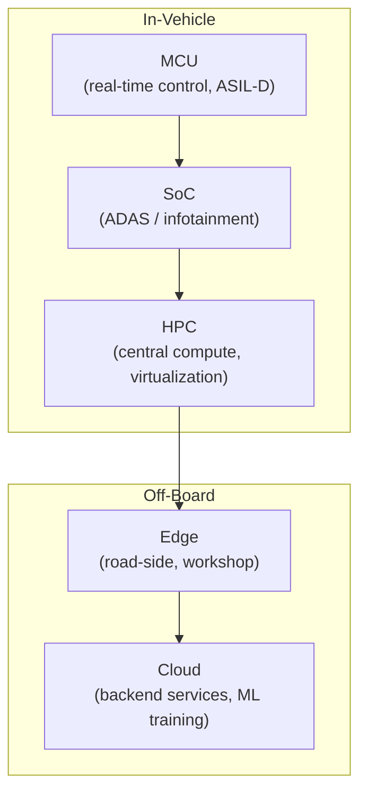
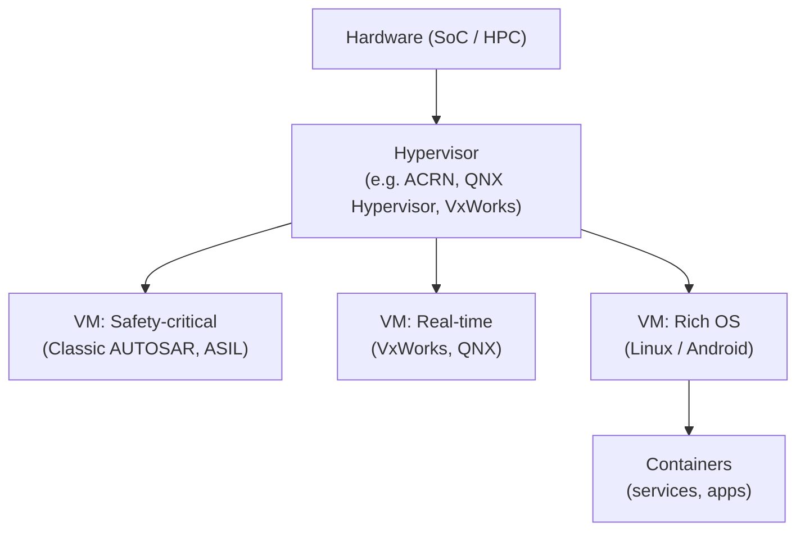
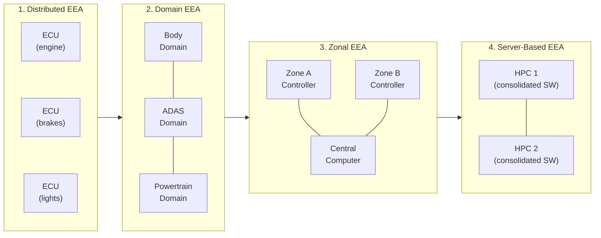
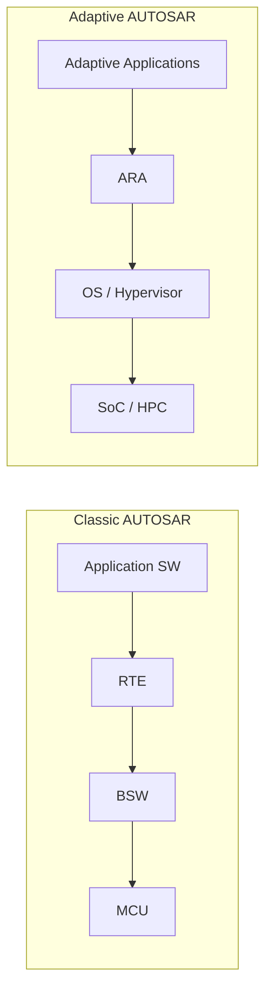
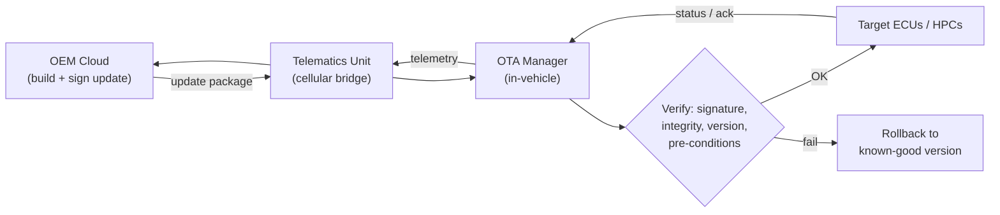
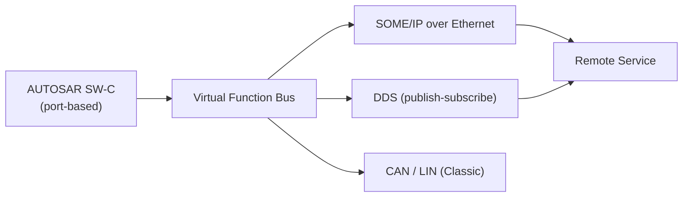

# Software-Defined Vehicles (SDV) and Architecture

**Document by:** Prashant Gawai
**Reviewed & reorganised:** 2026

---

## Table of Contents

- [Introduction](#introduction)
- [Tesla and Other Market Leaders](#tesla-and-other-market-leaders)
- [Demands](#demands)
- [Upcoming Challenges](#upcoming-challenges)
- [Requirements](#requirements)
- [IT Solutions (Summarised)](#it-solutions-summarised)
- [Vehicle E/E Architecture Evolution](#vehicle-ee-architecture-evolution)
- [Development Methodology](#development-methodology)
- [Computing](#computing)
- [Virtualisation](#virtualisation)
- [Architecture](#architecture)
- [Upgradability (OTA)](#upgradability)
- [Communication and Messaging](#communication-and-messaging)
- [Data Model and Interfaces, Standardisation](#data-model-and-interfaces-standardisation)
- [Containers](#containers)
- [Safety and Security](#safety-and-security)
- [Observability and Analysis](#observability-and-analysis)
- [High Availability and Disaster Recovery](#high-availability-and-disaster-recovery)
- [Identity and Access Management (IAM)](#identity-and-access-management-iam)
- [Validation and Verification](#validation-and-verification)
- [Integration and Deployment](#integration-and-deployment)
- [Services](#services)
- [Fault Management](#fault-management)
- [ADAS Stack](#adas-stack)
- [VxWorks](#vxworks)
- [References](#references)
- [Working Notes (Appendix)](#working-notes-appendix)

---

# Introduction

SDV means the advanced features and functions are primarily driven
through software. It significantly improves the safety and convenience
that improve the in-vehicle experience for consumers.

Automotive industry is seeing the transformation from hardware-based
devices to software-centric electronic devices. The premium vehicles
today can have 100s of ECUs and 150 million lines of software code and a
growing array of sensors, cameras, radar, lidar (light detection and
ranging) devices.

Apart from the horsepower, torque - today consumers are looking for
software features such as driver assistance features, infotainment and
intelligent connectivity solutions in the car.

For any software upgrades (whether it is about infotainment, telematics
or diagnostics) the vehicle needs a trip to dealership. With the OTA
(over-the-air) vehicles will be able to upgrade themselves with
additional security patches, upgrade to infotainment and core
functionalities too.

OEMs, parts manufacturers and software companies will have to strengthen
the software capabilities. The product development, organisational
structure, and operational systems will have to be altered to suit the
software-defined vehicle reforms.

As of 2023, it is estimated that software accounts for less than 10% of
the vehicle bill-of-material costs, which will increase to 50% by 2030.

Software and improvements in performance and functions will be
distinguishing factors for future vehicles.

**References:**

[https://www.automotiveworld.com/news-releases/what-is-a-software-defined-vehicle/](https://www.automotiveworld.com/news-releases/what-is-a-software-defined-vehicle/)

[https://www.arm.com/markets/automotive/software-defined-vehicles](https://www.arm.com/markets/automotive/software-defined-vehicles)

[https://www2.deloitte.com/content/dam/Deloitte/cn/Documents/consumer-business/deloitte-cn-cb-software-defines-vehicles-en-210225.pdf](https://www2.deloitte.com/content/dam/Deloitte/cn/Documents/consumer-business/deloitte-cn-cb-software-defines-vehicles-en-210225.pdf)

# Tesla and Other Market Leaders

Tesla is a leader of this trend. The innovation of Tesla is remarkable,
however 2 of the decisions are most impacting. First, they decoupled the
network-functions from the proprietary hardware appliances. This enabled
them to carry out parallel hardware and software development. Secondly,
OTA which eventually let them commercialise the software part, in which
they offered monthly software updates for performance and function
improvement.

Tesla architecture is the most advanced in terms of SDV. They can get a
central-computing platform and autopilot package and the software
subscription like SaaS, which differentiated their software marketing
and maximised the lifecycle and value cycle of vehicles.

OEMs have begun the strategic transformation of their existing and
building the new software capabilities in a more modular and
service-oriented architecture. This would help them manage the growing
complexity of the vehicle technology and yet achieve the time to market.
The parts manufacturers and emerging software companies would support
the development process for profitable and faster time-to-market.

# Demands

<table>
<thead>
<tr>
<th><blockquote>

<strong>Consumer Demands:</strong>

</blockquote>
<ul>
<li>
Innovative, continuously improving and personalised
experience
</li>
<li>
Cost effective
</li>
<li>
More security and safety
</li>
</ul></th>
<th><blockquote>

<strong>OEM Demands:</strong>

</blockquote>
<ul>
<li>
Cater to end-user demands
</li>
<li>
Faster time to market
</li>
<li>
Reduced Production Cost
</li>
<li>
Reduce Complexity
</li>
<li>
Increase Maintainability
</li>
</ul></th>
</tr>
<tr>
<th><blockquote>

<strong>Automotive Industry Demands:</strong>

</blockquote>
<ul>
<li>
Software based functions
</li>
<li>
Modularity
</li>
<li>
Standardisation
</li>
</ul></th>
<th><blockquote>

<strong>Technology Demands:</strong>

</blockquote>
<ul>
<li>
Faster adoption of various technologies
</li>
<li>
Use of AI, ML and DS
</li>
</ul></th>
</tr>
</thead>
<tbody>
</tbody>
</table>

Reference:

FEV Vehicle day seminar

# Upcoming challenges

**(A) Data Processing and Compute Power**

There are more than 100 ECUs present in L2 luxury cars.

- The current ECU model (which is Microcontroller or Microcomputer +
  Embedded System were designed for "Controlling" and NOT for
  "Computing". ECUs can handle limited compute and control tasks.

- So the biggest challenge is of "data processing" and "computing speed"

So the current Distributed EEA (Electronic and Electrical Architecture)
is NOT sufficient.

- The L2 autonomous driving software already reached 10 TOPS (Tera
  Operations Per Second), whereas estimated to exceed to 100 TOPS for L4

**(B) one-to-one matching of ECUs and Sensors**

Uptil now ECUs have been used in controlling engine operations,
controlling chassis and functions like IVI (in-vehicle infotainment)
etc; however, there is one-to-one correspondence between ECUs and
sensors and actuators, so there was NO interference and the systems are
majorly independent.

So computing is NOT shared among the controllers.

- Thus it is difficult to optimise the distribution of computing power
  when processing similar functional logic, resulting in wasted
  computing resources.

**(C) Containerisation and challenges**

Containers are highly scalable and are one of the primary ways to
implement High Availability.

Following are the challenges faced in its adoption:

- New to automotive, need change in mindset

- Separation of hardware and software is needed

- Container performance

- Service Management is additional task

- Cloud approach of resources is different, in vehicle - limited
  resources

**Reference:**

[https://www2.deloitte.com/content/dam/Deloitte/cn/Documents/consumer-business/deloitte-cn-cb-software-defines-vehicles-en-210225.pdf](https://www2.deloitte.com/content/dam/Deloitte/cn/Documents/consumer-business/deloitte-cn-cb-software-defines-vehicles-en-210225.pdf)

# Requirements:

1.  From Domain to Zonal Architecture (centralising compute)

2.  Modular

3.  Standardisation

4.  Performance

5.  Scalable

6.  Reusable components

7.  Reliability

8.  Availability

9.  Security

10. OTA

11. Service Oriented (discovery, messaging)

12. Hardware Abstraction

13. Agile development methods

14. AUTOSAR

15. Container based

16. FUSA

17. Compliance

18. Version Management

19. Continuous Integration and Continuous Deployment

20. Observability, Diagnostic, logging, tracing, health monitoring

21. Connectivity with Edge and Cloud based services

22. Right use of GPU, NPU, CPU, MPU

# IT Solutions (summarised):

The IT solutions for the above mentioned requirements/demands are given
below:

### **Development Methodology**

- Agile methodologies

- Or Scaled Agile

<!-- -->

- Or Large-Scale Scrum development

### **Computing**:

- Microcontrollers

- SoC (System on Chip)

<!-- -->

- HPC (High Performance Compute)

- Distributed Computing

- Edge Computing

- Cloud Computing

### **Virtualization:**

- Hypervisor

- Containers

- Virtual Machine

- Orchestrator

### **Architecture:**

- Monolith, SOA & Microservices

- Modular Architecture

- Adaptive & Classic AUTOSAR

<!-- -->

- Standardisation

- Managed Dependencies

### **Upgradability:**

- OTA

<!-- -->

- SOTA (Software-Over-The-Air)

- FOTA (Firmware-Over-The-Air)

### **Communication & Messaging:**

- Ethernet

<!-- -->

- CAN-ETH

- SOME/IP

- DDS

- Virtual Function Bus (VFB)

- Distributed Application Runtime

Reference:
[https://www.autosar.org/fileadmin/standards/R20-11/CP/AUTOSAR_EXP_VFB.pdf](https://www.autosar.org/fileadmin/standards/R20-11/CP/AUTOSAR_EXP_VFB.pdf)

### Data Model and Interfaces - standardisation:

- Standardisation of **data models** and **interfaces** (COVESA - CVII
  initiative)

### **Safety and Security:**

- Safety (**Accidental** Failures) of Life, Property and Environment

- Mechanical System Safety

<!-- -->

- EE System Safety

- DAS Safety

- ISO 26262

- Security (**Intentional** Attacks) of Privacy, Financial, Operational
  Performance

- Physical Security

<!-- -->

- Cyber Security (Network Security, Application Security, Information
  Security)

- DAS Safety

- SAE J3061 (Cybersecurity for Vehicle)

Reference:
[https://www.researchgate.net/figure/Safety-and-security-in-Autonomous-Vehicles_fig1_324006032](https://www.researchgate.net/figure/Safety-and-security-in-Autonomous-Vehicles_fig1_324006032)

### **Observability and Analysis**

- OpenTelemetry

Reference:
[https://www.alibabacloud.com/blog/future-direction-of-observability-in-cloud-native-a-case-study-of-autonomous-driving_597700](https://www.alibabacloud.com/blog/future-direction-of-observability-in-cloud-native-a-case-study-of-autonomous-driving_597700)

### **Availability:**

- HADR (High Availability and Disaster Recovery)

- High Availability through Redundancy

- High Availability through Failover

- High Availability through clustering

- Minimising impact of maintenance

### **Access Management:**

- VPN / VPC

- AUTH.N / AUTH.Z / IAM (Identity and Access Management)

### **Validation and Verification:**

- Simulation

- Validation

### **Integration and Deployment:**

- CI-CD

- DevOps

# Development Methodology

SDV development needs fast, iterative delivery. Common approaches:

- **Agile methodologies** — iterative sprints, continuous feedback
- **Scaled Agile (SAFe)** — scaling agile across large programs / multiple teams
- **Large-Scale Scrum (LeSS)** — scaling Scrum principles to many teams

Why it matters for SDV:

- Software can be updated **over-the-air**, so capabilities ship incrementally.
- **Hardware and software** can be decoupled and developed in parallel.
- **Continuous integration & deployment (CI/CD)** and DevOps practices enable frequent, verified releases.

# Computing

Modern SDV platforms span several compute tiers. Besides functional-safety (FUSA) priorities, clusters can be formed based on:

1. GPU requirements
2. NPU requirements
3. MPU requirements
4. High / low network requirements
5. High / low memory requirements
6. High / low compute requirements
7. High / low storage requirements

Compute domains in an SDV:

- **Microcontrollers (MCU)** — real-time control (Classic AUTOSAR, safety-critical)
- **System-on-Chip (SoC)** — high-performance applications (infotainment, ADAS)
- **High-Performance Compute (HPC)** — centralised vehicle compute
- **Distributed / Edge / Cloud computing** — extend vehicle compute off-board

Choosing the right engine for the right workload (CPU / GPU / NPU / MCU) is covered in the companion document *CPU, GPU, MCU, NPU in automotive*.

# Virtualisation

Virtualisation lets multiple operating systems and applications with **different criticality** share one physical compute platform (consolidation):

- **Hypervisor (Type 1 / Type 2)** — partitions hardware and isolates workloads
- **Virtual Machines (VM)** — full OS isolation
- **Containers** — lightweight, application-level isolation
- **Orchestrator** — manages container lifecycle, scaling and high availability (e.g. Kubernetes)

Typical mixed-criticality layout in a zonal / central-compute platform:

Key considerations:

- **Functional safety**: isolation must be strong enough to meet ISO 26262 independence requirements.
- **Security**: a compromised partition must not affect safety-critical partitions.
- **Performance**: minimise hypervisor overhead for real-time workloads.

# Vehicle E/E Architecture Evolution

The **electrical/electronic architecture (EEA)** of a vehicle defines how computing, sensing, actuation and networking are distributed across the car. As vehicles became software-centric, the EEA has evolved through several generations:

## Distributed (Traditional) EEA

- Historically, vehicles used **100+ independent ECUs**, each controlling a specific set of sensors, actuators or functions.
- Each ECU has **its own network connection** and manages its communication directly, as suitable.
- Computing is **not shared** between controllers → poor compute utilisation, limited scalability, and every update requires physical access.

## Domain EEA

- Groups similar functions into **domains** to simplify software and to manage data from the centre.
- Example domains:
  - **Body:** lighting, HVAC, motor controls
  - **Infotainment:** audio, radio, instrument cluster, entertainment
  - **Connectivity:** telematics, V2X, smart car access
  - **Powertrain:** engine management, xEV / EV
  - **ADAS:** radar, vision, HPC
  - **Gateway:** secure central access to vehicle data
- Domain controllers manage data flow **from the edge to the centre**.

## Partially Zonal

- A **hybrid mix** of zonal and domain architecture implementations.
- The number of ECUs is reduced by moving their processing to the **zone controller** or to the **central computer**.
- The central processor takes over tasks that were previously distributed across the car, reducing complexity, reducing total ECU count, and improving the OEM's ability to update software and add features.
- Zone controllers manage the distribution of **data and power**.

## Fully Zonal

- Domain architecture groups similar functions together, but that **increases complexity**; zonal architecture **simplifies the network** with a simplified structure.
- Electronics are clustered **by proximity (zone)** rather than by function.
- Each zone has a **zonal gateway** that connects to the central-computing cluster.
- Inter-zonal communication uses **small, high-speed networking cables**.
- Benefits: eases wiring / cabling, eases networking, reduces complexity.
- Challenge: it is a **big design change** from the established domain approach.

## Server-Based (Central Compute)

- The end-state of centralisation: powerful **High-Performance Compute (HPC)** servers (or a small cluster of them) host most vehicle functions as software services.
- Functional consolidation enables cloud-style **OTA software updates**, resource pooling, and multi-tenancy via **hypervisors and containers**.

## Evolution at a Glance

# Architecture

1.  Overall view

1)  Private Cloud based services could be from:

<!-- -->

1.  Manufacturer

2.  3rd Party Service Providers

    1.  They are used for:

    2.  Data storage and processing:

    3.  Algorithm development and testing:

    4.  Collaborative development:

    5.  Real-time data processing:

    6.  Security and data-privacy by private-cloud provider

    7.  Scalability: satisfies scale up-or-down demands for computing

    8.  Regulatory compliance: as per industry standards

    9.  Firmware and Software Updates:

<!-- -->

2)  Edge Computing helps in automotive in following ways:

<!-- -->

1.  Edge allows data processing closer to the data source rather than to
    a centralised cloud server.

2.  ADAS

    1.  Real-time data processing from sensors, camera, lidar, radar

3.  In-vehicle infotainment

    1.  Streaming of music, videos

4.  Vehicle to Everything (V2X) communication

    1.  Vehicle communicating with each other, with infrastructure, with
        pedestrians - allowing safety-critical messages and alerts

5.  Predictive Maintenance:

    1.  Help identify potential issues before they lead to breakdown

6.  Traffic Management:

    1.  Process data from various sources, such as traffic cameras,
        sensors

7.  Local Data Storage and Analysis:

    1.  Some data collected by vehicles such as driving patterns,
        weather conditions, road quality and can be analysed locally
        using edge computing.

8.  Data Privacy and Security:

    1.  Helps keep sensitive information within vehicle or local network
        thus reducing cloud traffic

9.  Fleet Management:

    1.  Helps in managing fleets of vehicles, processing data related to
        location, fuel efficiency, driver behaviour etc.

10. Augmented Reality (AR) Navigation:

    1.  AR helps in real-time camera feeds thus providing navigation
        instructions on live-view of the road

<!-- -->

2.  (in-vehicle) Operating System view

3.  (in-vehicle) Network, Switches and IPC view

4.  (in-vehicle) Shared Resources view

5.  (in-vehicle) Mixed Architecture Communication

1.  Classic AUTOSAR components

2.  Adaptive AUTOSAR components

3.  Non-AUTOSAR components

Each of these would have different interfaces, so we would need an
adapter pattern based modules to connect these components

**AUTOSAR (Automotive Open System Architecture)** is a standardised automotive software architecture that promotes the interoperability, scalability and portability of software components across different automotive systems. **Classic AUTOSAR** and **Adaptive AUTOSAR** are two specifications within the AUTOSAR framework, each designed for different types of automotive systems.

### Differences between Classic and Adaptive AUTOSAR

#### 1. System Architecture

- **Classic AUTOSAR:** Designed for traditional, deeply embedded systems with fixed functionality and predictable runtime behaviour. Follows a layered architecture with clear separation between application software and the Basic Software (BSW) layer.
- **Adaptive AUTOSAR:** Tailored for flexible, high-performance computing platforms, including connected and autonomous vehicles. Supports dynamic reconfiguration, advanced communication protocols, and runtime updates.

#### 2. Runtime Environment

- **Classic AUTOSAR:** Operates on resource-constrained, microcontroller-based ECUs with deterministic real-time behaviour.
- **Adaptive AUTOSAR:** Targets powerful multicore ECUs with more resources, supporting sophisticated operating systems (e.g. Linux) and virtualisation for hosting applications with varying criticality.

#### 3. Communication and Networking

- **Classic AUTOSAR:** Primarily relies on CAN and LIN for in-vehicle communication, with support for other protocols such as Ethernet.
- **Adaptive AUTOSAR:** Emphasises Ethernet-based communication for higher bandwidth, lower latency, and IP-based protocols — essential for ADAS and autonomous driving.

#### 4. Software Architecture

- **Classic AUTOSAR:** Static, configuration-based approach; software components and their interactions are defined at development time.
- **Adaptive AUTOSAR:** Supports dynamic software composition and runtime updates, allowing the system to adapt to changing requirements and conditions.

### Similarities

1. **Standards Compliance:** Both adhere to the same fundamental principles defined by AUTOSAR, ensuring compatibility and interoperability.
2. **Tooling Support:** Most development tools, methodologies and processes for Classic AUTOSAR also apply to Adaptive AUTOSAR, with some adjustments.

### Example Use Cases

- **Classic AUTOSAR** suits traditional safety-critical ECUs such as engine control, transmission control, body control and chassis systems (ABS, ESC), where real-time performance and determinism are critical.
- **Adaptive AUTOSAR** suits high-performance platforms such as ADAS, autonomous driving, infotainment, telematics and OTA updates, where dynamic reconfiguration and high compute are required.

### Summary

Classic AUTOSAR is ideal for traditional automotive systems with fixed functionality and deterministic behaviour; Adaptive AUTOSAR is tailored for dynamic, high-performance platforms required for advanced driver assistance, autonomous driving and connected-car applications.

6.  AUTOSAR Runtime for Adaptive Applications (ARA)

7.  (in-vehicle) Container and Services View

8.  HPC view

Depending on the ASIL levels, the applications could be categorised, and
could further be categorised based on the priority they carry.

We've to see how these components would map on the VxWorks environment.

**A word about cluster (in more in the logical form):**

The word cluster used in this document is a cluster as mentioned in the
context of Kubernetes. However, if the use of Kubernetes is NOT
possible, and we have to dilute the meaning of cluster then it would be
defined as a 'logical' group of few nodes (instances) kept under
namespace.

We should be able to define operations to be conducted on these
clusters, would happen in the ACID manner (i.e. atomicity, consistency,
isolation and durability is followed). That means, all changes to the
cluster are performed as if they are a single operation.

**Service Mesh**

To take care of:

- Load balancing

- Service discovery

- Health checks

- Authentication

- Traffic management and routing

- Circuit breaking and failover policy

- Security

- Metrics and telemetry

Candidate implementations to evaluate:

- **Envoy** — high-performance sidecar proxy / data plane
- **Istio** — service mesh control plane (built on Envoy)

## Approach to migration

**Identification Phase:​**

1.  identifying components that need splitting (into logical separate
    components)​

2.  understanding the relationship and dependencies of these locally
    separate components​

3.  Identifying the components that would possibly be merged (having
    similar data) or could be group of components​

4.  Identify and deal with missing fields or values​

5.  Identify outliers ​

6.  identifying 'most used', 'low-latency', 'very-very-low-latency'
    requirements (or depending on NFR parameters)​

7.  refactoring or adding many test cases for identified FRs, NFRs for
    'existing applications' (data points/benchmarking from monolith L2+
    working system)​

**Data Model and Interface designing:**

1.  Common Vehicle Interface Initiative - CVII
    ([https://wiki.covesa.global/](https://wiki.covesa.global/))​

2.  Design Dependencies and APIs (Abstraction Layer)​

3.  like REST API: stateless, versioned​

**Infrastructure Phase:**

1.  Infrastructure readiness​

2.  Identify latency addition by Containerization​

**Development and Verification​ Phase:**

1.  implementation (TDD, verification at logical steps)​

2.  "One", "Verified" change "at a time" (with full-CI-CD-automation +
    SIL)​

3.  Integration tests (BDD, Gerkin)​

4.  System test (HIL, SIL etc.)​

5.  Deployment​

​

## Workflow for combined systems

Reference:
[https://www.youtube.com/watch?v=qGxY5d8Cx14](https://www.youtube.com/watch?v=qGxY5d8Cx14)

1.  AR Classic specific:

2.  AR Adaptive specific:

3.  Common Tasks:

    1.  Common for Classic and Adaptive

4.  Connection Task:

    1.  Tasks that connect different part of Adaptive and Classic

## SOA Framework

Introduction

SOA Components

Service Definition

Service Registration

Service Discovery

Service Orchestration

Service Deployment

Service Granularity

API Gateway Design

Single Vs Multi-Instantiation

SOME/IP vs DDS

- [https://standards.ieee.org/wp-content/uploads/import/documents/other/eipatd-presentations/2021/additional-presentation.pdf](https://standards.ieee.org/wp-content/uploads/import/documents/other/eipatd-presentations/2021/additional-presentation.pdf)

- [https://stackoverflow.com/questions/51182471/whats-the-difference-between-dds-and-some-ip#:~:text=A%20significant%20difference%20between%20DDS,any%20changes%20to%20application%20code](https://stackoverflow.com/questions/51182471/whats-the-difference-between-dds-and-some-ip#:~:text=A%20significant%20difference%20between%20DDS,any%20changes%20to%20application%20code).

**Service**: logical entity defined by one more more published
interfaces

Service **Provider**: entity that implements service specification

Service **Consumer**: client that calls provider

Service **Locator**: registry, examines interfaces exposed and location

Service **Broker**: this passes service request to one or more providers

What makes a service, a Service?

- Service Description

- Service Interface

- Service Implementation

- Service Communication Protocol

- Transport

## Service System Design:

### Service Design:

1.  List of services

2.  Relationship with each other

### Service Interface Design

1.  For each service, define:

    1.  Properties of the service

    2.  Methods / Functions it provides

    3.  Events

### Service Interface Binding

1.  For each service, define:

    1.  SOME/IP interfaces

        1.  getProperty1() (1401)

        2.  getProperty2() (1402)

        3.  someipmethod1()

        4.  someipmethod2()

        5.  Someip-event (12345)

## Sidecar architecture

- Reduces complexity by abstracting common infra-related functionalities

- Reduces code duplication (specially configuration)

- Adds loose coupling between application code and underlying platform

# Upgradability

OTA updates allow automakers to update vehicle's software and firmware
over a wireless connection, to improve vehicle functionality, fix bugs,
enhance security and add new features without requiring owners to visit
a dealership or service centre.

5 categories of OTA:

1.  Software over-the-air (SOTA)

    1.  Underlying software components

2.  Firmware over-the-air (FOTA)

    1.  Main system software that controls underlying hardware

3.  Application over-the-air (AOTA)

    1.  In-vehicle applications update, e.g. map app, music app etc.

4.  Configuration over-the-air (COTA)

    1.  Vehicle configuration to boost performance, range, comfort etc

5.  Over-the-air service provisioning (OTASP)

6.  Over-the-air provisioning (OTAP)

7.  Over-the-air parameter administration (OTAPA)

## Process

## OTA Architecture

**Telematic Unit**

There exists a Telematic Unit that provides cellular connectivity.
Telematic Unit acts as a bridge between the vehicle and manufacturer's
servers, enabling communication for OTA updates.

**Server infrastructure**

There exist dedicated servers to manage and distribute OTA updates.
These servers store update packages, manage user authentication, and
ensure delivery of updates to the appropriate vehicles.

**User Interface**

The infotainment system, or smartphone app allows car owners to view,
schedule updates and monitor progress.

OTA updates involve sensitive software that can impact vehicle safety
and performance.

**Crucial components of OTA update strategies are:**

1.  **Versioning**: numbering or tagging different releases of vehicle
    software and firmware

2.  **Configuration Management**: adjust settings and parameters within
    vehicle software.

3.  **Rollback Strategies**: in case of any unexpected issues or safety
    concern, revert to previous known-good version of the software

4.  **Security Measures**: robust security measures for preventing
    unauthorised access, ensuring integrity and authentication of update
    packages, protection from cyber threats or hacking attacks.

### OTA Update Flow

# Communication and Messaging

In-vehicle and vehicle-to-external communication spans several protocols, each suited to different latency / bandwidth / determinism needs:

| Protocol | Domain | Characteristics |
|---|---|---|
| **CAN / CAN-FD / LIN** | Classic control | Low cost, deterministic, low bandwidth |
| **Ethernet (TSN)** | Backbone / zonal | High bandwidth, time-sensitive networking |
| **CAN-Ethernet gateway** | Bridging | Connects classic domains to backbone |
| **SOME/IP** | Service-oriented (AUTOSAR) | RPC-style service calls over Ethernet |
| **DDS** | Data-centric (publish-subscribe) | QoS, real-time, decentralised |
| **VFB (Virtual Function Bus)** | AUTOSAR abstraction | Abstract communication between software components |

# Data Model and Interfaces, standardisation

GENIVI, W3C are building CVII (Common Vehicle Interface Initiative),
with coordination with many other standards viz. AUTOSAR, SENSORIS,
eSync, ISO (SAE), ASAM/ODX, JASPAR, CATENA-X, ITU, ISO/IEC JTC1, DTC,
ISO/IEC WG11, ISO TC 204, OPIN, GAIA-X, EATA etc, then, it is safe to
assume we could refer or work inline with the recommendations provided
by it.

## CVII (Common Vehicle Interface Initiative)

Purpose:

1.  Common data model across industry

2.  Remove unnecessary diversity about data model

3.  Service-model standardisation

Has:

1.  Data & Service Models

2.  Data & Service Standard Catalogues

3.  Technology Stack

- Format converters

- Code generators

- Comm. protocols

- Code libraries

- Data Storage

- Data Analysis

- etc.

Standards:

1.  Vehicle Signal Specification, VSS, - model+catalogue

2.  VSS Ontology, VSSo (extends VSS, derivations)

3.  VSS-layers (metadata, deployment details)

4.  VSC model (w/ RPCs and API description)

## Vehicle Signal Specification (VSS)

[https://covesa.github.io/vehicle_signal_specification/](https://covesa.github.io/vehicle_signal_specification/)

[https://github.com/COVESA/vehicle_signal_specification/tree/master/spec](https://github.com/COVESA/vehicle_signal_specification/tree/master/spec)

[https://w3c.github.io/vsso/spec/vsso-primer.html](https://w3c.github.io/vsso/spec/vsso-primer.html)

# Containers

## Options:

Docker, K8S, OCI, CRI-O, containerd & runc

\[docker\] \[K8S\] - tools used by developers

\[CRI\] - k8s API to interact with runtimes

\[containerd\] \[CRI-O\] - runtimes (containerd-by-docker, CRI-O by
RedHat)

> (OCI) - specifications
>
> \[runc\] - OCI-compliant tool for spaw/run containers

\[container\] \[container\] - finally, container

We shall see if runc could be used directly; so as to achieve the
performance. POC needed to evaluate this.

**Digging into runtimes**:
[https://blog.quarkslab.com/digging-into-runtimes-runc.html](https://blog.quarkslab.com/digging-into-runtimes-runc.html)

**Running containers in cars**:
[https://www.redhat.com/en/blog/running-containers-cars](https://www.redhat.com/en/blog/running-containers-cars)

## Pause - Resume Containers:

[https://docs.oracle.com/en/learn/container-instances-compute/index.html#objectives](https://docs.oracle.com/en/learn/container-instances-compute/index.html#objectives)

[https://github.com/opencontainers/runc/blob/main/pause.go](https://github.com/opencontainers/runc/blob/main/pause.go)

# Safety and Security

# Observability and Analysis

High-Level process for Observability would have following main points:

## Approach:

Approach to implementing observability in SDV:

**1. Component Instrumentation:**

Instrument software components within the vehicle's architecture to
collect relevant data. This includes the vehicle's operating system,
software modules controlling various functions (infotainment, autonomous
driving, etc.), and communication buses.

**2. Telemetry and Logging:**

Implement telemetry to collect real-time data from software components.
This could include metrics like CPU usage, memory consumption, network
traffic, and internal states. Set up structured logging to capture
events and activities, aiding in debugging.

**3. Distributed Tracing:**

Utilise distributed tracing to track the flow of requests and messages
between software components. This helps identify bottlenecks and
performance issues across the complex software landscape of the vehicle.

**4. Health Probes and Liveness Checks:**

Implement health probes and liveness checks within software components
to continuously monitor their availability and responsiveness. This
enables early detection of component failures.

**5. Service Mesh:**

If your software-defined vehicle uses a microservices architecture,
consider implementing a service mesh. This provides observability
features like service discovery, load balancing, and monitoring for all
microservices.

**6. Real-time Monitoring:**

Set up real-time monitoring tools to visualise data and metrics in
real-time. Use tools like Prometheus and Grafana to create customizable
dashboards for various stakeholders.

**7. Anomaly Detection and Alerts:**

Implement anomaly detection algorithms that analyse data streams for
deviations from expected behaviour. Trigger alerts to notify engineers
and operators about potential issues.

**8. Over-the-Air (OTA) Updates:**

Integrate observability into OTA update processes. Monitor the success
and impact of updates, and roll back changes if anomalies are detected
post-update.

**9. Security Monitoring:**

Implement security-focused observability to detect and respond to
potential security breaches or vulnerabilities in the software stack.

**10. Data Privacy and Compliance:**

Ensure that observability practices adhere to data privacy regulations.
Anonymize or pseudonymised data where necessary to protect user privacy.

**11. Machine Learning for Predictive Insights:**

Apply machine learning algorithms to historical and real-time data to
predict software component failures or performance degradation. This can
facilitate predictive maintenance.

**12. Continuous Improvement:**

Regularly review and refine your observability strategy. This might
involve adjusting what data you collect, updating monitoring thresholds,
and improving anomaly detection models.

**13. User Experience Monitoring:**

Incorporate user experience monitoring to understand how users interact
with software features. This can help identify areas for improvement and
user satisfaction.

**14. Collaboration and Integration:**

Collaborate across software engineering, data science, and automotive
teams to integrate observability practices seamlessly into the software
development lifecycle.

Designing observability for a software-defined vehicle requires a
holistic approach that considers the interconnectedness of various
software components and their impact on overall vehicle performance and
safety. It's essential to have a strong data analytics team to process
and interpret the collected data effectively.

## Component Diagram

## Hybrid approach for Data Storage:

1.  Local storage for real-time data

2.  Centralised storage for analysis and archival

3.  More considerations:

<!-- -->

1.  Implement data redundancy and backup specially for critical data

2.  Define data-sharing protocols and proper synchronisation interval

3.  Implement privacy and security measures for local-central data

<!-- -->

4.  Integrate Real-time monitoring integration

5.  Synchronise with cloud-storage

## Tools:

1.  **CANoe/CANalyzer**: monitor, analyse CAN, and support simulation

    1.  Vector tools

2.  **AUTOSAR System View**: AUTOSAR-compliant systems often provide
    tools.

    1.  dSPACE SystemDesk

    2.  Elektrobit EB tresos Studio

3.  **Diagnostics Tools**: On-Board Diagnostics (OBD) scanners and to
    monitor troubleshoot issues.

    1.  Bosch KTS series

    2.  Actia Multi-Diag

    3.  Delphi DS

4.  **Trace Tools**: capture runtime behaviour and interactions between
    software components. They provide insights into timing, data-flow,
    dependencies.

    1.  Lauterbach TRACE32

    2.  iSystem winIDEA

    3.  ETAS ISOLAR-EVE

    4.  DLT Viewer

5.  **Log Analysis Tools**: Tools to aggregate, search and analyse logs

    1.  ELK Stack (Elasticsearch, Logstash, Kibana)

    2.  Splunk

    3.  Graylog

    4.  loggly

6.  **Performance Monitoring Tools**: Profilers and Performance
    Monitoring Units (PMUs) help assess the runtime performance.
    Identify hotspots during code-execution and resource utilisation.

    1.  Lauterbach TRACE32, Percepio Tracealyzer

    2.  Arm DS-5

7.  **Network Analysers**:

    1.  wireshark

8.  **Remote Monitoring and Telemetry Platforms**:

    1.  Aribiquity's OTAmatic

    2.  Sibros platform

    3.  Movimento's Over-The-Air (OTA)

9.  **Simulation and Emulation Tools**:

    1.  dSPACE VEOS

    2.  MathWorks Simulink

    3.  QEMU (Quick EMUIator)

10. **Security and Compliance Tools**:

    1.  Blackberry Jarvis

    2.  Green Hills Software INTEGRITY Security Services

    3.  MISRA Compliance Tools (e.g. LDRA) help ensure security and
        compliance with standards like ISO 26262

# High Availability and Disaster Recovery

## Typical Scenario:

> Normal case:
>
> (User) → (UI Service) → (Payment Service) → (DB)
>
> Local HA:
>
> (User) → (UI Service) → (Payment Service) → (DB)
>
> (UI Service) → (Payment Service) → (DB)
>
> Replication:
>
> Region-1:
>
> (region-1-User) → (UI Service) → (Payment Service) → (DB)
>
> (UI Service) → (Payment Service) → (DB)
>
> Region-2:
>
> (region-2-User) → (UI Service) → (Payment Service) → (DB)
>
> (UI Service) → (Payment Service) → (DB)

Issues:

- Handle requests: Load Balancer

- Data Consistency: Replication

- Cost: Active Active

Disaster Recovery:

- Active Passive (SLA)

—----------

**In terms of K8S,**

> (Control Plane) and (worker nodes) (worker nodes) (worker nodes)
> (worker nodes)

Terminology: (CP) (Control Plane), (WN) (Worker Node), (LB) (Load
Balancer)

**For HA, 3-minimum, 5-maximum of (CP)**

> (CP) (CP) (CP)

**Result:**

> (Requests) → (cluster of LBs) → (3 / 5 CPs) → (WNs)

**In cloud environment:**

> 3 DCs in different zones
>
> \(DC\) (DC) (DC)

Typically,

If you can not afford, combine (CP) and (WN) on one instance

If you can afford, (Zone-1:\[(CP),(WNs)\]), (Zone-2:\[(CP)(WNs)\]),
(Zone-3:\[(CP),(WNs)\])

—----------

## Article: High-Availability RTOSs Deliver five-nines Reliability

[https://www.electronicdesign.com/technologies/industrial/boards/article/21772609/electronic-design-highavailability-rtoss-deliver-fivenines-reliability](https://www.electronicdesign.com/technologies/industrial/boards/article/21772609/electronic-design-highavailability-rtoss-deliver-fivenines-reliability)

### Learnings in Hardware Systems:

Following are the ways to have HA in hardware systems:

1.  RAID disk (redundant arrays of hard disks)

2.  Hot-swapping capability: for instance, CompactPCI Serial Boards

3.  Multi-Processor links: for instance, InfiniBand and PCI Express

### Learnings in Software Systems:

In real-time systems following ways are used:

1.  Checkpointing (preserve safe-state of application; restart from
    point if app fails)

2.  Transaction Support

3.  Application Heartbeat support

In general, a high-availability system should have the following
software services:

- Heartbeat support for each server and each application.

- Event management capability for change notification.

- Alarm management for error handling.

- Transactions capability for check-pointing and rollback/restart.

- Clustering for server management and applications links.

- Reliable storage support for RAIDs and for journaling file systems.

# Identity and Access Management (IAM)

## Introduction:

Ensures proper,

\(1\) identification

\(2\) authentication

\(3\) authorisation - for people, groups of people, software
applications.

Prevents unauthorised access to software and hardware systems, resources
and data.

**Identity Management** (IdM) consists of user-management component and
central directory component such as AD (active directory)

**User Management** manages administrative authority, **roles** and
responsibilities of each user and groups, provisioning and
deprovisioning user accounts and password management.

**Central directory** is a repository of all user and group data for an
enterprise which could span over on-premise, public and private cloud or
multi-cloud infrastructure.

**Authentication** manages sign-on, single-sign-on, managing active
sessions, providing tokens etc.

**Authorisation** uses roles, attributes and rules to determine user,
device or application permissions to resources.

**Identity Management** is about managing attributes related to user,
group of users, or other identity that may require access to resources.

**Access Management** is about evaluating those attributes based on
policies or rules and making an access decision based on it.

**Access control**:

- Access Control List (ACL): list of permissions with system resources

- Role-Based Access Control (RBAC)

- Attribute Based Access Control (ABAC)

- Relationship Based Access Control (ReBAC)

- Organisation Based Access Control (OrBAC)

**RBAC**:

## Considerations:

I can think of following type of IAM considerations,

1.  External:

    1.  Between Vehicle Manufacturer and Software Services provider

    2.  Between Vehicle Manufacturer and Vehicle Owners

    3.  Between External Software Providers and Vehicle Owners

2.  External -\> Vehicle:

    1.  Between Vehicle Manufacturer and Vehicle

    2.  Between External Software Services Provider and Vehicle

    3.  Between Vehicle Owner and Vehicle

3.  Within Vehicle (intra-vehicle):

    1.  Between different clusters of services depending on:

        1.  ASIL Level

        2.  Security Aspects

        3.  Location (how far or close from the Vehicle Gateway)

    2.  Between ECUs

    3.  Between Zones

    4.  Between ECUs and Zone/Domain Controller

4.  Inter-Vehicle:

    1.  Vehicle and Private or Public Node Controllers

Considerations for External-\>Vehicle:

1.  Manufacturer Identity w.r.t. the vehicles and any updates to it

2.  Service provider's identity and any updates to it

3.  Identity of the Vehicle Owner and any updates to it

4.  Identity of the cluster of services w.r.t. the expected changes or
    type-of-changes

5.  Manufacturer infrastructure would have the IAM Server

6.  Vehicles would have IAM Client that would respond to requests

Diagrammatically,

> **Note:** IAM in the automotive domain spans many components and areas; the design is non-trivial and industry guidance is still maturing. This section will be expanded in a future revision.

# Validation and Verification

Validation and verification (V&V) confirm that the SDV platform is both **built correctly** (verification) and **the right system** (validation):

- **Verification** — is the implementation correct against the design?
  - Unit testing
  - Integration testing
  - Software-in-the-Loop (SIL)
  - Hardware-in-the-Loop (HIL)
- **Validation** — does the system fulfil its intended purpose in real-world conditions?
  - Field testing
  - Scenario-based testing (see ISO 34502)
  - Simulation
  - Compliance testing against safety / security regulations

See the companion document *Automotive Testing* for the full X-in-the-loop (MIL / SIL / HIL / VIL) picture.

# Integration and Deployment

- **CI/CD** — continuous integration of code changes and continuous delivery of verified artifacts.
- **DevOps** — collaboration between development and operations; automation of build, test and release.
- **Deployment targets** — in-vehicle (via OTA), edge, and cloud backend.
- **Canary / staged rollout** — deploy to a fleet subset first, monitor, then broaden.

# Services

Service:​ We need a framework​

Principles (stateless, repository, Encapsulation, Longevity, transparent
location)​

Orchestration (Discovery, Fault-Tolerant, Health Check)​

Invocation​

Producer-Consumer​

Stream, Reactive, EDA​

Patterns (SAGA, Circuit Breaker, Rate limiting, Observability, Security,
Deployment, API Gateway, Load Balancer)

## 12 factor App

1.  Code base

    - one codebase, tracked revisions, many deploys

2.  Dependencies

    - Explicitly declared and isolated

3.  Config

    - Store config in the environment

4.  Backing Services

    - Treat backing services as attached resources

5.  Build, Release, Run

    - Strictly separate build and run stages

6.  Processes

    - Execute the app as one or more stateless processes

7.  Port binding

    - Export services via port binding

8.  Concurrency

    - Scale out via the process model

9.  Disposability

    - Maximise robustness with fast startup and graceful shutdown

10. Dev / Prod parity

    - Keep development, staging and production as similar as possible

11. Logs

    - Treat logs as event streams

12. Admin processes

    - Run admin/management tasks as one-off processes

# Fault Management

There are 5 steps:

1.  Detection: know something's gone wrong

2.  Isolation / Diagnosis: identify source and location of the issue

3.  Correlation: analyse potential causes and effects

4.  Restoration: mitigate the problem and reestablish proper operations

5.  Resolution: Confirm and document that the problem is fixed

# ADAS Stack

The ADAS (Advanced Driver Assistance Systems) software stack spans the full chain from raw sensor data to vehicle actuation:

The four functional levels of the automated-driving stack are:

1. **Perception** — traversability (valid vs invalid space), semantic understanding, object detection.
2. **Planning** — generate a trajectory to reach the destination safely.
3. **Control** — longitudinal (forward / speed) and lateral (left / right).
4. **Actuation** — throttle / braking and steering.

See the companion document *ADAS* for details on sensors, features and automation levels.

# VxWorks

Link:
[https://www.windriver.com/sites/default/files/2022-02/605577969.pdf](https://www.windriver.com/sites/default/files/2022-02/605577969.pdf)

- secure, safe, reliable, and certifiable

VxWorks is the ONLY RTOS to support the latest versions of Python,
C++17, Rust, and Boost.

Helix Platform enables the consolidation of multiple embedded computing
operating systems onto a single device.

# References

Communication:

Open DDS:
[https://opendds.readthedocs.io/en/latest-release/devguide/introduction.html](https://opendds.readthedocs.io/en/latest-release/devguide/introduction.html)

Vsomeip:
[https://github.com/COVESA/vsomeip/wiki/vsomeip-in-10-minutes](https://github.com/COVESA/vsomeip/wiki/vsomeip-in-10-minutes)

Container:

[https://blog.quarkslab.com/digging-into-runtimes-runc.html](https://blog.quarkslab.com/digging-into-runtimes-runc.html)

[https://github.com/opencontainers/runc](https://github.com/opencontainers/runc)

[https://opencontainers.org/community/overview/](https://opencontainers.org/community/overview/)

HA:

[https://www.cisco.com/c/en/us/solutions/hybrid-work/what-is-high-availability.html](https://www.cisco.com/c/en/us/solutions/hybrid-work/what-is-high-availability.html)

# Working Notes (Appendix)

Raw notes captured during the research phase (kept for reference):

- 2 SoCs – 1st architecture
- TI4vm – SoC
- S32G3 – Network gateway
- ACF – middleware enabling pub-sub, DDS, zero-memory-copy
- Wind River Linux – virtualisation
- Open Container Initiative (OCI)
- OSP
- NXP
- CVC – Exposed gateway (NXP)
- SIL – more open-loop
- HIL – open- and closed-loop operations
- Out of scope – VHEIL, DIL, VIL
- Optional – logging, re-simulation
