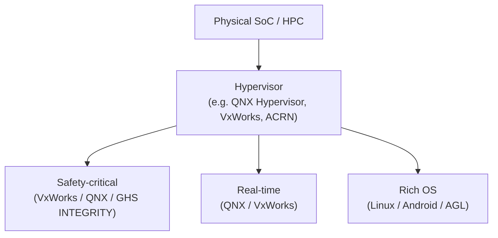

# Real-Time Operating Systems in Automotive (Linux / AGL, QNX, VxWorks, GHS)

**Author:** Prashant Gawai

> Originally drafted with an AI assistant; reviewed and restructured for the automotive context.

## Table of Contents

- [1. Linux](#1-linux)
- [1.1 Key details about AGL](#11-key-details-about-agl)
- [2. QNX](#2-qnx)
- [3. VxWorks](#3-vxworks)
- [4. GHS (Green Hills Software)](#4-ghs-green-hills-software)
- [Comparison of RTOS Options](#comparison-of-rtos-options)
- [Mixed-Criticality Consolidation](#mixed-criticality-consolidation)
- [Sample Examples](#sample-examples)

---

## Comparison of RTOS Options

| | Linux (AGL) | QNX | VxWorks | GHS INTEGRITY |
|---|---|---|---|---|
| Type | Open source, general purpose | Commercial RTOS (microkernel) | Commercial RTOS | Commercial RTOS (separation kernel) |
| Determinism | Configurable (PREEMPT_RT) | High | High | High |
| Safety | Functional-safety frameworks (AGL) | ISO 26262 certified | ISO 26262 certifiable | High assurance / ISO 26262 |
| Typical use | Infotainment, telematics, connectivity | ADAS, digital cockpit, autonomous platforms | ECUs, powertrain, active safety | Safety-critical ADAS, security-critical |
| Strengths | Rich ecosystem, open source | Fault tolerance, microkernel isolation | Real-time responsiveness, networking stack | Security, memory protection, separation |

## Mixed-Criticality Consolidation

Modern zonal / central-compute platforms consolidate several operating systems of **different criticality** onto one physical SoC using a **hypervisor**:

---

# 1. Linux:

- **Explanation:** Linux is an open-source operating system kernel that forms the basis for various Linux distributions. It offers a robust and versatile platform for general-purpose computing with a vast range of software support.
- **Similarities:** Like other real-time operating systems (RTOS), Linux can be configured to provide real-time capabilities using preemptive scheduling and other techniques.
- **Differences:** Compared to specialised RTOSs like QNX and VxWorks, Linux may have higher latency and less deterministic response times due to its general-purpose nature.
- **Key Uses in Automotive:** Linux is widely used for infotainment systems, in-vehicle entertainment, telematics, and connectivity. For example, the **Automotive Grade Linux (AGL)** project provides a Linux-based platform designed specifically for automotive applications.

# 1.1 Key details about AGL:

**AGL (Automotive Grade Linux)** is an open-source software project focused on creating a unified platform for the automotive industry. It provides a flexible, customisable Linux-based operating system and development environment as a foundation for a wide range of in-vehicle applications and services.

1. **Objective:** accelerate the development and adoption of open-source software in automotive; reduce fragmentation and enable collaboration among automakers, suppliers, and technology companies.
2. **Linux Foundation Project:** hosted by the Linux Foundation; benefits from its expertise and collaboration network.
3. **Architecture:** built on a Linux kernel using a **Yocto Project** build system; layered architecture — lower layers handle hardware abstraction, higher layers provide application frameworks and services.
4. **Components:** Linux kernel, middleware, application framework and applications; includes **Wayland/Weston** for display management, **Qt** for application development, and connectivity frameworks such as Bluetooth and Wi-Fi.
5. **Functional Safety and Security:** strong emphasis on both; features and tools to support safety-related applications and security best practices against cyber threats.
6. **Application Ecosystem:** supports multiple programming languages; provides APIs, SDKs and development tools.
7. **Collaboration and Adoption:** fosters collaboration via working groups and hackathons.
8. **Use Cases:** infotainment, telematics, instrument clusters, ADAS and more.
9. **Companies and Automakers:** supported by Toyota, Honda, Mazda, Subaru and others; technology companies and semiconductor manufacturers also contribute.
10. **Open Source and Licensing:** licensed under open-source licenses (GPL, Apache), enabling collaboration, customisation and distribution.

# 2. QNX:

- **Explanation:** QNX is a commercial real-time operating system known for its reliability, determinism, and safety-critical capabilities. It offers a **microkernel architecture** and a comprehensive set of tools and libraries for embedded systems development.
- **Similarities:** Like other RTOSs, QNX provides real-time capabilities and deterministic behaviour, ensuring precise timing and response in critical applications.
- **Differences:** QNX is known for a high level of determinism, fault tolerance, and safety-critical features, making it popular for safety-critical automotive systems.
- **Key Uses in Automotive:** QNX is extensively used in safety-critical systems such as ADAS, instrument clusters, digital cockpits, and autonomous driving platforms. For example, **QNX Neutrino RTOS** is used in BlackBerry's QNX Hypervisor for integrating multiple operating systems in automotive ECUs.

# 3. VxWorks:

- **Explanation:** VxWorks is a real-time operating system developed by **Wind River Systems**. It is known for real-time responsiveness, determinism, and high reliability, making it suitable for mission-critical applications.
- **Similarities:** Like QNX, VxWorks is an RTOS designed to provide real-time capabilities and deterministic behaviour for critical applications.
- **Differences:** VxWorks offers a comprehensive real-time kernel, a robust networking stack, and extensive device-driver support. It is used in demanding environments where safety, reliability, and performance are crucial.
- **Key Uses in Automotive:** VxWorks is used in ECUs, powertrain control modules, active safety systems, and vehicle networking. For example, VxWorks has been deployed in autonomous-vehicle platforms such as the **Roborace** self-driving racing car.
- **Modern capabilities:** VxWorks is one of the few RTOSs supporting the latest versions of Python, C++17, Rust, and Boost; the **Helix Platform** enables consolidation of multiple embedded operating systems onto a single device.

# 4. GHS (Green Hills Software):

- **Explanation:** GHS provides the **INTEGRITY** real-time operating system, a commercially available RTOS known for safety, security, and high performance.
- **Similarities:** Like QNX and VxWorks, GHS INTEGRITY offers real-time capabilities and deterministic behaviour, and is used in safety-critical systems.
- **Differences:** GHS focuses on highly secure and reliable operating systems, including features like **memory protection**, **separation kernels**, and high-assurance development tools.
- **Key Uses in Automotive:** GHS INTEGRITY is used in safety-critical systems such as ADAS, engine control units, and powertrain management, ensuring safety, security, and reliable operation.

# Sample Examples:

1. **Linux:** Automotive Grade Linux (AGL) — open-source, used in infotainment, navigation and connected-car applications.
2. **QNX:** QNX Neutrino RTOS — used in safety-critical systems such as ADAS platforms and instrument clusters.
3. **VxWorks:** used in engine control units (ECUs), powertrain management and active safety systems.
4. **GHS INTEGRITY:** used in safety-critical systems like ADAS platforms and powertrain control units to ensure safety, security, and reliability.
