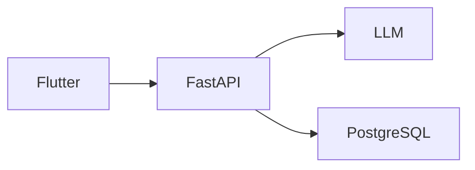

# Markdown → Word

Converts Markdown files to `.docx`, including:

- Headings
- Paragraphs
- Bold / italic / strikethrough
- Hyperlinks
- Local images
- Remote images
- Tables
- Ordered / unordered lists
- Blockquotes
- Fenced code blocks
- Mermaid diagrams

## 1. Python setup

```bash
python3 -m venv .venv
source .venv/bin/activate
pip install -r requirements.txt
pip install -e .
```

## 2. Install Mermaid CLI

Mermaid diagrams require Node.js and Mermaid CLI.

```bash
npm install -g @mermaid-js/mermaid-cli
```

Verify:

```bash
mmdc --version
```

## 3. Convert

```bash
md-to-word input/document.md
```

Or:

```bash
python -m md_to_word.main input/document.md -o output/document.docx
```

## Example Markdown

```markdown
# Architecture

This is a [FastAPI](https://fastapi.tiangolo.com/) application.




| Component | Technology |
|---|---|
| Frontend | Flutter |
| Backend | FastAPI |
```

The Mermaid block is rendered to an image and embedded into the Word document.

## Notes

This project intentionally uses Mermaid CLI rather than trying to implement Mermaid rendering in Python.

For complex Markdown extensions, additional parser support may be needed.
