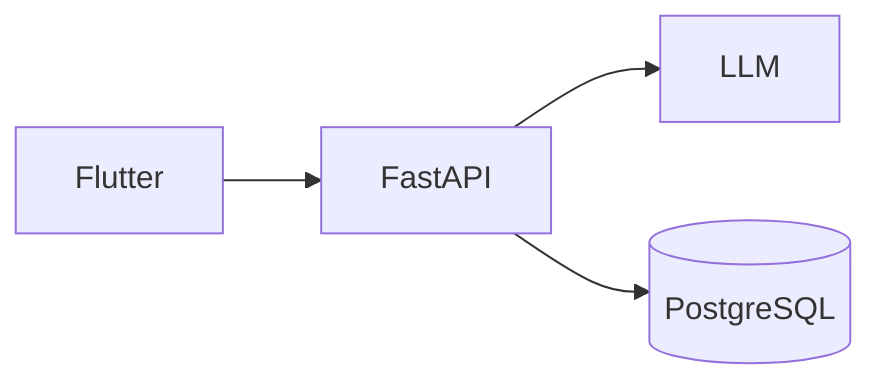

# Sample Architecture Document

This is a **Markdown to Word** test document.

Visit the [FastAPI documentation](https://fastapi.tiangolo.com/).

## Architecture



## Components

| Component | Technology |
|---|---|
| Frontend | Flutter |
| Backend | FastAPI |
| Database | PostgreSQL |

### Code

```python
def hello():
    return "Hello, Word!"
```

- First item
- Second item
  - Nested item

> This is a blockquote.
