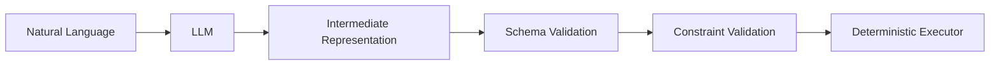
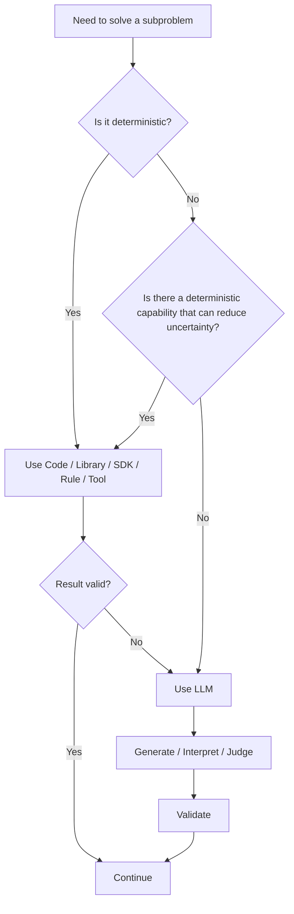
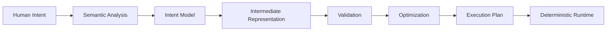
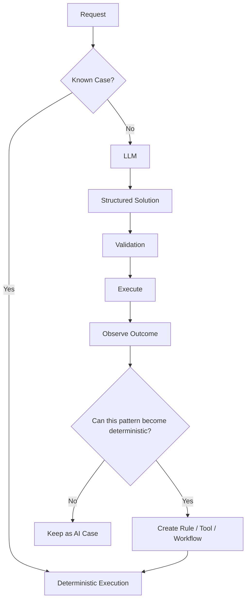

# From Probabilistic AI to Deterministic Engineering

## Left-Shifting Intelligence, Right-Shifting Certainty

### Abstract

The rapid adoption of Large Language Models (LLMs) is changing how software is designed and developed. Developers can now delegate requirements analysis, coding, debugging, documentation, testing, and even architectural decisions to AI systems.

However, this creates a fundamental architectural problem: **LLMs are probabilistic systems being increasingly used to perform tasks that are inherently deterministic.**

The same input can produce different outputs. Model upgrades can change behavior. Prompt changes can alter execution. Agentic systems can take different paths through the same problem. As more LLM calls are chained together, the uncertainty of individual decisions can propagate through the system.

A more reliable approach is to **left-shift AI usage toward ambiguity, interpretation, discovery, and solution formulation—and then rapidly convert the resulting understanding into deterministic representations, rules, constraints, workflows, APIs, tools, libraries, SDKs, and executable specifications.**

In this architecture, the LLM is not the primary execution engine.

It is the **semantic interpreter, solution explorer, fallback mechanism, and judge where appropriate**.

The deterministic software system performs the actual execution wherever determinism is possible.

This article proposes a practical engineering philosophy:

> **Use AI where uncertainty exists. Convert uncertainty into structure as early as possible. Then maximize deterministic execution.**

---

# 1. The AI Engineering Paradox

AI has made software development dramatically more productive.

A developer can now say:

> "Build a service that processes customer applications, validates eligibility, calculates the benefit, stores the result, and exposes an API."

An LLM can generate a substantial amount of the implementation.

But there is an important question that is often overlooked:

**Should the LLM remain involved in solving the problem after the problem has become deterministic?**

Consider:


This architecture is attractive because it is flexible.

It is also difficult to reason about.

Every additional probabilistic decision introduces another opportunity for:

* incorrect interpretation
* hallucination
* inconsistent reasoning
* incorrect tool selection
* incorrect parameters
* unexpected execution paths
* prompt sensitivity
* model-version sensitivity
* context-window effects

The problem is not that LLMs are "bad."

The problem is **using a probabilistic mechanism where a deterministic mechanism already exists.**

---

# 2. Deterministic Problems Do Not Need Probabilistic Solutions

Many software problems are fundamentally deterministic.

For example:

```text
if customer.age >= 21
and customer.income >= 50000
and customer.credit_score >= 700
then eligible = true
```

There is no reason to ask an LLM to calculate this.

Likewise:

* sorting records
* validating JSON
* validating schemas
* calculating interest
* executing SQL
* authenticating a user
* checking authorization
* applying business rules
* validating API contracts
* transforming structured data
* executing a state machine
* performing mathematical calculations
* processing transactions

are all better handled by deterministic mechanisms.

The LLM should not replace the programming language, database, rules engine, compiler, validator, workflow engine, cryptographic library, or domain SDK simply because it can produce an answer that appears plausible.

The question should instead be:

> **What is the smallest part of this problem that genuinely requires probabilistic intelligence?**

That question changes the architecture.

---

# 3. The Core Principle: Left-Shift Intelligence, Right-Shift Certainty

The proposed architecture has two complementary movements.

### Left-shift AI

Move AI toward the **beginning of the problem-solving lifecycle**:

* understand the request
* identify intent
* discover requirements
* extract entities
* interpret unstructured information
* identify constraints
* generate candidate solutions
* map the problem to known capabilities
* select appropriate tools
* identify ambiguities

### Right-shift deterministic execution

Once sufficient structure has been discovered:

* validate
* normalize
* constrain
* compile
* execute
* calculate
* persist
* orchestrate
* monitor

using deterministic mechanisms.


The key transition is:

> **Natural language → structured representation**

That is the architectural uncertainty boundary.

---

# 4. The Uncertainty Boundary

Every AI-enabled system should explicitly identify its **uncertainty boundary**.

Before the boundary, the system may deal with:

* ambiguity
* natural language
* incomplete requirements
* semantic interpretation
* unknown patterns
* unstructured documents
* human intent

After the boundary, the system should progressively become:

* typed
* constrained
* validated
* executable
* reproducible
* testable
* observable

Conceptually:

```text
                  UNCERTAINTY BOUNDARY
                         │
                         ▼
┌──────────────┐    ┌─────────────┐    ┌──────────────────────────────┐
│ Human Intent │───▶│     LLM     │───▶│ Structured Representation   │
└──────────────┘    └─────────────┘    └──────────────┬───────────────┘
                                                       │
                                                       ▼
                                      ┌──────────────────────────────┐
                                      │ Schema / Constraint Validation│
                                      └──────────────┬───────────────┘
                                                     │
                                                     ▼
                                      ┌──────────────────────────────┐
                                      │ Deterministic Tools / SDKs    │
                                      └──────────────┬───────────────┘
                                                     │
                                                     ▼
                                      ┌──────────────────────────────┐
                                      │ Rules / Workflow / State      │
                                      └──────────────┬───────────────┘
                                                     │
                                                     ▼
                                      ┌──────────────────────────────┐
                                      │ Deterministic Execution       │
                                      └──────────────────────────────┘
```

A mature AI system should try to **move this boundary leftward over time**.

---

# 5. LLM as Semantic Compiler

One useful mental model is to treat an LLM like a compiler front-end.

A compiler accepts something expressive and human-friendly and converts it into a representation that can be executed reliably.

AI systems can follow the same pattern.



The intermediate representation could be:

* JSON
* Pydantic models
* Protocol Buffers
* OpenAPI
* SQL
* ASTs
* DSLs
* state machines
* DAGs
* decision tables
* workflow definitions
* typed commands

For example:

```json
{
  "intent": "calculate_loan_eligibility",
  "customer": {
    "age": 38,
    "income": 120000,
    "credit_score": 742
  },
  "operation": "evaluate"
}
```

The LLM's responsibility ends after producing a valid representation.

From that point:

```text
JSON
  ↓
Schema validation
  ↓
Business rules
  ↓
Calculation
  ↓
Persistence
  ↓
API response
```

does not require an LLM.

---

# 6. Tools Are Determinism Amplifiers

This leads to another important principle:

> **Do not merely ask an LLM to solve a problem. Give it access to deterministic capabilities that can solve parts of the problem better than the LLM itself.**

Instead of:

```text
LLM → answer
```

prefer:

```text
LLM → identify required operation → deterministic tool → result
```

Examples include:

| Capability            | Prefer                            |
| --------------------- | --------------------------------- |
| Arithmetic            | Calculator / code                 |
| Date calculations     | Date/time library                 |
| Data validation       | Schema validator                  |
| SQL execution         | Database                          |
| Search                | Search engine / indexed retrieval |
| Vector retrieval      | Vector database                   |
| Graph traversal       | Graph database                    |
| Authentication        | Identity provider                 |
| Authorization         | Policy engine                     |
| Cryptography          | Established crypto library        |
| PDF extraction        | Dedicated parser                  |
| OCR                   | OCR engine                        |
| Image processing      | Computer vision library           |
| Financial calculation | Domain library                    |
| Workflow execution    | Workflow engine                   |
| State management      | State machine                     |
| API invocation        | Typed SDK                         |
| Serialization         | Standard serializer               |
| Data transformation   | Code / ETL engine                 |

The LLM should **orchestrate capabilities**, not impersonate them.

---

# 7. "Tool First, LLM Second"

A useful decision hierarchy is:



This creates a hierarchy:

### Level 1 — Deterministic mechanism

Use an existing:

* API
* SDK
* library
* algorithm
* rules engine
* database
* workflow engine

### Level 2 — Deterministic code

If no suitable capability exists, implement the logic.

### Level 3 — LLM

Use an LLM when the problem genuinely requires:

* semantic reasoning
* interpretation
* ambiguity resolution
* generation
* pattern recognition
* natural-language interaction

### Level 4 — Human

For high-impact unresolved ambiguity, escalate to a human rather than forcing the LLM to guess.

---

# 8. LLM as Fallback, Not Default

A powerful architecture therefore looks like:

```text
                 ┌──────────────────────┐
                 │      Request         │
                 └──────────┬───────────┘
                            ▼
                 ┌──────────────────────┐
                 │ Deterministic Router │
                 └──────────┬───────────┘
                            │
              ┌─────────────┴─────────────┐
              ▼                           ▼
     ┌─────────────────┐         ┌─────────────────┐
     │ Known Operation │         │ Unknown /       │
     │                 │         │ Ambiguous       │
     └────────┬────────┘         └────────┬────────┘
              │                           │
              ▼                           ▼
     ┌─────────────────┐         ┌─────────────────┐
     │ Tool / SDK /     │         │      LLM        │
     │ Rule / Workflow  │         │ Interpretation  │
     └────────┬────────┘         └────────┬────────┘
              │                           │
              │                           ▼
              │                  ┌─────────────────┐
              │                  │ Structured      │
              │                  │ Representation  │
              │                  └────────┬────────┘
              │                           │
              └───────────────┬───────────┘
                              ▼
                    ┌─────────────────────┐
                    │ Validation / Judge  │
                    └──────────┬──────────┘
                               ▼
                    ┌─────────────────────┐
                    │ Deterministic       │
                    │ Execution           │
                    └─────────────────────┘
```

This reverses the common assumption.

Instead of:

> **LLM → everything else**

we get:

> **Deterministic capability → LLM only when necessary → deterministic execution**

---

# 9. LLM as a Judge

There is another useful role for the LLM: **judgment at the boundary of uncertainty**.

Suppose a deterministic system produces:

```json
{
  "customer_id": "C123",
  "eligibility": true,
  "reason_codes": ["INCOME_OK", "AGE_OK", "CREDIT_OK"]
}
```

A deterministic validator can verify:

* schema
* required fields
* data types
* ranges
* rule consistency
* mathematical correctness

But there may be a semantic question:

> "Does this result actually satisfy the intent expressed by the user?"

An LLM can perform that semantic judgment.

This creates:

```text
Deterministic execution
        ↓
Structured result
        ↓
Deterministic validation
        ↓
Semantic LLM judge
        ↓
Accept / Reject / Escalate
```

The LLM isn't responsible for generating the entire answer.

It is responsible for evaluating a bounded proposition.

That is a much smaller and more controllable probabilistic surface.

---

# 10. Constrain the LLM's Output

Another important architectural rule is:

> **Never allow free-form output when a constrained representation is possible.**

Instead of:

```text
"Please tell me what should happen."
```

prefer:

```json
{
  "action": "APPROVE",
  "confidence": 0.93,
  "reason_codes": [
    "ELIGIBLE_INCOME",
    "ELIGIBLE_CREDIT"
  ]
}
```

Then validate it using a schema.

The pipeline becomes:

```text
LLM
 ↓
Structured Output
 ↓
Schema Validation
 ↓
Business Validation
 ↓
Execution
```

This is dramatically easier to test than unrestricted text generation.

---

# 11. The "AI Compiler" Architecture

A mature architecture can therefore resemble a compiler pipeline.



The analogy is useful:

| Traditional Compiler        | AI System                     |
| --------------------------- | ----------------------------- |
| Source code                 | Natural language              |
| Parser                      | LLM                           |
| Semantic analysis           | Intent/entity interpretation  |
| AST                         | Structured representation     |
| Type checker                | Schema validator              |
| Compiler optimization       | Plan optimization             |
| Intermediate representation | AI workflow/command model     |
| Runtime                     | Deterministic tools/workflows |
| Program execution           | Business execution            |

The LLM becomes the **semantic front-end**.

The deterministic system becomes the **runtime**.

---

# 12. Agentic AI Should Not Mean "LLM Everywhere"

Agentic architectures are often represented as:

```text
Agent
 ↓
LLM
 ↓
Agent
 ↓
LLM
 ↓
Tool
 ↓
LLM
 ↓
Agent
```

This can create unnecessary probabilistic loops.

A stronger agentic architecture is:

```text
                 ┌───────────────┐
                 │ Orchestrator  │
                 └───────┬───────┘
                         │
              ┌──────────┴──────────┐
              ▼                     ▼
       Deterministic           LLM Agent
       Workflow                only for
       / Rules                 ambiguity
              │                     │
              │                     ▼
              │              Structured Plan
              │                     │
              └──────────┬──────────┘
                         ▼
                 Deterministic
                    Runtime
```

The agent should ideally produce **plans**, not perform every operation itself.

For example:

```json
{
  "workflow": "customer_onboarding",
  "steps": [
    {
      "operation": "validate_identity"
    },
    {
      "operation": "check_credit"
    },
    {
      "operation": "calculate_limit"
    },
    {
      "operation": "create_account"
    }
  ]
}
```

The workflow engine can execute this plan deterministically.

---

# 13. RAG Also Benefits From This Principle

RAG systems frequently use an LLM for:

```text
question → retrieval → answer
```

But the retrieval stage itself can become increasingly deterministic.

For example:

```text
User Question
     ↓
LLM: Query Interpretation
     ↓
Structured Query
     ↓
Metadata Filters
     ↓
Deterministic Retrieval
     ↓
Ranking
     ↓
Context
     ↓
LLM: Semantic Synthesis
```

The LLM handles semantic interpretation and synthesis.

The retrieval infrastructure handles:

* filtering
* indexing
* ranking
* access control
* document identity
* versioning
* metadata
* provenance

This produces a much more auditable RAG architecture.

---

# 14. From "AI-First" to "Capability-First"

The broader philosophy can be called:

## Capability-First AI

Before asking an LLM to solve something, ask:

1. Is there already a library?
2. Is there an SDK?
3. Is there an API?
4. Is there a deterministic algorithm?
5. Is there a database capability?
6. Is there a rules engine?
7. Is there a workflow engine?
8. Is there a schema or type system?
9. Is there a policy engine?
10. Can the problem be expressed as a deterministic state transition?

Only after these questions should we ask:

> **What genuinely requires an LLM?**

This is especially important in enterprise architecture because organizations already have enormous amounts of deterministic infrastructure.

AI should **connect and augment that infrastructure**, not unnecessarily replace it.

---

# 15. Deterministic Closure

A useful concept emerging from this architecture is:

## Deterministic Closure

A problem is **deterministically closed** when all remaining operations can be expressed through known:

* inputs
* schemas
* rules
* constraints
* algorithms
* tools
* workflows
* APIs

without requiring further probabilistic reasoning.

For example:

```text
User:
"Find out whether this customer qualifies for product X."

            ↓

LLM:
Intent = PRODUCT_X_ELIGIBILITY
Customer = C123

            ↓

Deterministic closure:

Customer data
    +
Eligibility rules
    +
Product constraints
    +
Calculation
    +
Policy validation

            ↓

RESULT
```

The objective of the AI system should be to reach deterministic closure **as early as practical**.

---

# 16. Measuring the Architecture

This philosophy can also be measured.

Instead of measuring only:

* tokens
* latency
* model accuracy
* cost

we should introduce metrics such as:

### Probabilistic Surface Area

What percentage of the execution path depends on probabilistic decisions?

### Deterministic Coverage

What percentage of operations are handled by deterministic mechanisms?

### AI Escape Rate

How often does the system need to invoke the LLM?

### Deterministic Closure Rate

What percentage of requests reach a fully deterministic execution plan?

### Fallback Rate

How often does a deterministic mechanism fail and require AI assistance?

### Reproducibility

Given identical inputs and system state, how frequently does the system produce identical results?

### Rule Conversion Rate

How many previously AI-dependent decisions have been converted into deterministic rules?

These metrics provide a very different view of AI maturity.

---

# 17. A Mature System Should Become Less Dependent on AI

This may sound counterintuitive.

But a mature AI system should ideally **reduce its dependence on the LLM for known cases**.

Imagine a system that starts with:

```text
100% AI
```

Over time:

```text
80% AI
20% deterministic
```

Then:

```text
50% AI
50% deterministic
```

Eventually:

```text
15% AI
85% deterministic
```

The remaining 15% represents the genuinely ambiguous or novel portion of the problem space.

This is not a failure of AI.

It is evidence that the system has **learned how to operationalize its domain**.

---

# 18. A Feedback Loop for Continuous Determinization

The architecture can go one step further.

Every LLM fallback can become an opportunity to discover a new deterministic capability.



This produces an evolutionary architecture:

> **Unknown → AI → validated solution → deterministic capability → known case**

Over time, the deterministic capability grows.

---

# 19. Software Engineering in the Age of AI

This also changes the role of the software engineer.

The future engineer should not simply become better at prompting.

They should become better at:

* problem decomposition
* identifying uncertainty
* designing contracts
* defining schemas
* designing state machines
* selecting deterministic tools
* creating domain-specific abstractions
* designing validation layers
* building executable specifications
* establishing observability
* defining invariants
* designing fallback strategies
* controlling AI boundaries

The key skill becomes:

> **Knowing where AI belongs—and, equally importantly, where it does not belong.**

---

# 20. The Architecture Principle

The entire approach can be summarized as:

```text
                 ┌───────────────────────────────┐
                 │       HUMAN / BUSINESS        │
                 │          INTENT                │
                 └───────────────┬───────────────┘
                                 │
                                 ▼
                 ┌───────────────────────────────┐
                 │             AI                │
                 │                               │
                 │ Understand                    │
                 │ Interpret                     │
                 │ Discover                      │
                 │ Classify                      │
                 │ Propose                       │
                 │ Resolve ambiguity             │
                 └───────────────┬───────────────┘
                                 │
                       STRUCTURED CONTRACT
                                 │
                                 ▼
        ┌────────────────────────────────────────────────┐
        │              DETERMINISTIC CORE                │
        │                                                │
        │ Schemas │ Rules │ APIs │ SDKs │ Libraries     │
        │ Tools   │ SQL   │ DAGs │ State │ Workflows    │
        │ Policies│ Math  │ Validators │ Algorithms     │
        └───────────────────────┬────────────────────────┘
                                │
                                ▼
                       DETERMINISTIC RESULT
                                │
                                ▼
                     ┌─────────────────────┐
                     │      AI JUDGE       │
                     │  when appropriate   │
                     └──────────┬──────────┘
                                │
                       ┌────────┴────────┐
                       ▼                 ▼
                     Accept           Escalate
```

---

# 21. The New AI Engineering Mantra

The traditional software engineering mantra was:

> **Don't reinvent the wheel.**

AI engineering should adopt another:

> **Don't ask an LLM to do what a deterministic system can do better.**

And another:

> **Use AI to cross the uncertainty boundary, not to live beyond it.**

And perhaps the most important:

> **The goal is not to maximize AI usage. The goal is to maximize reliable problem-solving.**

---

# 22. Conclusion

LLMs have introduced an extraordinary new capability: machines that can reason over language, infer intent, synthesize information, generate solutions, and interact with systems using natural language.

But this capability comes with probabilistic behavior.

The answer is not to avoid AI.

Nor is the answer to place an LLM at every layer of the architecture.

The better approach is to **architect the uncertainty out of the system as early as possible**.

Use AI for:

**interpretation → discovery → ambiguity → candidate solutions → structured intent**

Then transition rapidly to:

**schemas → constraints → tools → SDKs → libraries → rules → workflows → deterministic execution**

And bring AI back only when the system encounters something that genuinely requires probabilistic reasoning.

This creates a different kind of AI architecture:

> **AI at the edges. Determinism at the core.**

The most mature AI systems may therefore not be the ones with the most LLM calls.

They may be the ones that use **the smallest amount of probabilistic intelligence necessary to create the largest amount of deterministic value.**

That is the direction in which AI engineering should evolve:

### **From AI-first execution to deterministic-first engineering.**

### **From asking AI to solve everything to using AI to eliminate uncertainty.**

### **From probabilistic execution to deterministic closure.**

### **From LLM dependency to LLM leverage.**
