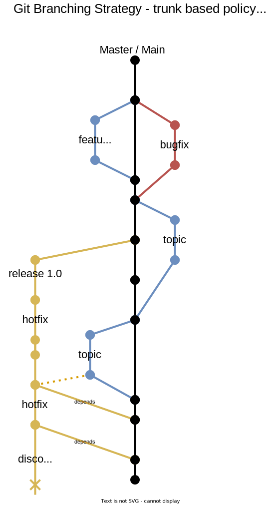

# GIT Branching Strategy

## Background
For a single project, when there multiple teammates are making changes to the source-code; it is required to maintain some strategies so that developers are able to organize their and their teammate's parallel development.

Following are some list of recommendations, drawn with experience and references of few sites:

## recommendations:
1. Educate each developer with use of `git`
1. Use 'Trunk based' git flow strategy
1. Small, simple changes: fewer merge conflicts, easy to code review, encourages pull requests, simpler to ship; faster velocity
1. Keep the 'main' branch protected
1. Strict completion or DOD (definition of done) policies
1. `main` branch will always have production-ready code
1. Enforce code reviews: least for `main`, `release` branches
1. Have 2+ `code reviewers`
1. Enforce `pull-requests` and merges process
1. Create release-branches, and lock them when stopped supporting
1. Link `pull requests` with the work items
1. Check all review `comments` are resolved
1. Maintain `commit history`; do NOT allow force pushes

## Branch Creation
1. as far as possible, stay close to `main` branch (trunk based policy)
1. have consistant names for branches
1. create different branches for their specific purposes (e.g. `develop`, `feature`, `release`, `bugfix`, `hotfix` etc)
1. branch-creation could be done under guidance of `Repository Owners` (create Repository Owners)

## Branch Naming:
```
[ feature | bugfix | hotfix ] / [ dev-id ] / [ task-id ] / < _short-description_ > 
```
e.g.
```
feature/ankush/task-2/add-progress-bar (recommended)
```
or simply,
```
feature/task-2/add-progress-bar
```
or simply,
```
feature/add-progress-bar
```

## Branches:




## References:
1. https://docs.microsoft.com/en-us/azure/devops/repos/git/git-branching-guidance?view=azure-devops
2. https://k21academy.com/microsoft-azure/az-400/branching-strategy-devops-git-branching-model-git-branch-policy-restoring-a-deleted-branch/